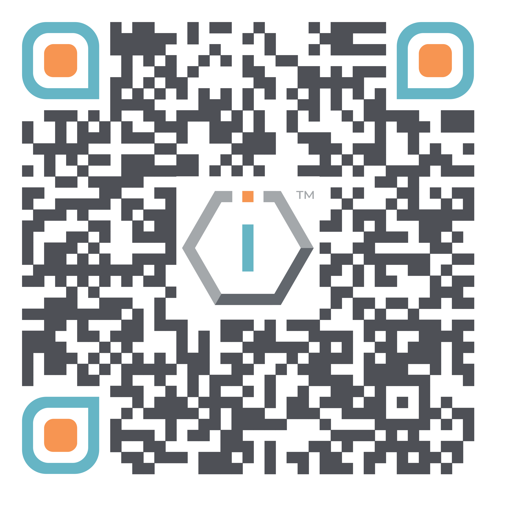

# Organization Brief




[**ShortURL**](https://short.theiofoundation.org/TIOFDocsOrgBrief) **|&#x20;**~~**Playbook**~~**&#x20;|&#x20;**~~**Assistant**~~




Use this QR Code to quickly share this page.

<figure><figcaption>
QR Code of this page
</figcaption></figure>




{% column width="58.333333333333336%" %}
## The organization

The IO Foundation is a global for-impact NGO championing [Data-Centric Digital Rights](https://short.theiofoundation.org/TIOFDCDRDocs) to strengthen users' protection through technical standards. Our work focuses on supporting technologists, the architects of modern civilization, to safeguard human and digital rights by advocating for robust digital infrastructure.

Actively engaged in Standard Developing Organizations, we raise awareness of their critical role within the technical community both locally and globally. Recognizing _technologists as the next generation of rights defenders_, we equip them through workshops and fellowships with the tools and knowledge to shape secure, trustworthy digital systems.

TIOF advances its work through the implementation of a number of [initiatives](./#initiatives).


{% column width="41.666666666666664%" %}


As core stakeholders, technologists play a critical role as the [Next Generation of Rights Defenders](https://short.theiofoundation.org/TIOFNextGen) and need to orient themselves through new design and implementation paradigms focused on protecting data. The [DCDR Principles](https://short.theiofoundation.org/DCDRPrinciples) are concepts that help them navigate the intricacies of applying Human and Digital Rights in digital infrastructures, products and services.



Our mission is driven by innovation, accountability and support to our community, ensuring technology serves humanity’s progress.






## Our Mission

`To promote, protect and provide solutions for Data-Centric Digital Rights.`



## Our Vision

`A world where Human Rights and Data-Centric Digital Rights are one and the same.`



## The challenges


{% column width="50%" %}
<i class="fa-hexagon-check">:hexagon-check:</i>  **The nature of data is largely misunderstood.**\
With currently 11 definitions of data worldwide, if we can't agree on that basic concept it will be virtually impossible to protect it effectively cross-borders.

<i class="fa-hexagon-check">:hexagon-check:</i>  **Technology is too complex for citizens and doesn't protect them properly.**\
Current regulations place too much burden on the citizens' shoulders.

<i class="fa-hexagon-check">:hexagon-check:</i>  **Technology, and in particular software, does not have a way to prove compliance to data protection laws in an objective, standardized manner.**\
In any properly regulated industry, companies only compete at value proposition level. In technology, they also compete at compliance level; enduring trust is not possible.&#x20;


{% column width="50%" %}
<i class="fa-hexagon-check">:hexagon-check:</i>  **Technologists do not have the necessary tools to be at the forefront of architecting and implementing better and safer technology.**\
Policy makers and civil society have failed at speaking to speak to technologists in a language they understand: clear, precise and definable problems + algorithms.

<i class="fa-hexagon-check">:hexagon-check:</i>  **Users should only be expected to be responsible citizens and not hackers.**\
The ever-increasing complexity of technology does not allow users to be in full control of their digital twins and what is done with them.

<i class="fa-hexagon-check">:hexagon-check:</i>  **Governments are increasingly becoming irrelevant by not being able to protect their own citizens' data.**\
\
\




## Our Values

The IO Foundation embraces the following values to drive its mission:

<table data-view="cards"><thead><tr><th></th><th></th><th></th></tr></thead><tbody><tr><td>
<i class="fa-bolt">:bolt:</i>  <strong>INNOVATIVE</strong>

      <strong>IMPACT</strong>
</td><td>
Our work only makes sense if we help digital users worldwide.

Our <a href="https://tiof.click/TIOFInitiatives">initiatives</a> are designed and implemented only to serve the broader <a href="https://tiof.click/DCDRAdvocacy">DCDR advocacy</a> and to help, step by step, generate practical outcomes that make technology better and safer transparently for digital citizens.
</td><td></td></tr><tr><td><i class="fa-eye">:eye:</i>  <strong>TRANSPARENCY</strong>        <strong>&#x26; ACCOUNTABILITY</strong></td><td>We recognize the critical importance of operating under procedures and methodologies that are transparent in order to generate the necessary trust in our <a href="https://tiof.click/DCDRPrinciples">DCDR Principles</a> and the advocacy at large. </td><td> <a href="https://app.gitbook.com/s/JXbvNyVmZ8duv0pk4SxH/about/project-information" class="button primary" data-icon="hexagon-plus">Discover Hexogate</a></td></tr><tr><td>
<i class="fa-users-rectangle">:users-rectangle:</i>  <strong>SUPPORTING</strong>

      <strong>COMMUNITY</strong>
</td><td><a href="https://tiof.click/DCDRAdvocacy">Data-Centric Digital Rights</a> is a global endeavor that requires the active participation of everyone, from policy makers to citizens, businesses and, most importantly technologists as architects and builders our digital societies. </td><td> <a href="https://app.gitbook.com/s/uld9T2tTIUQIOL2sa5b6/about/spotlight" class="button primary" data-icon="hexagon-plus">Discover Argos</a></td></tr></tbody></table>

## Our Guiding Principles

The IO Foundation's work is guided by the following Guiding Principles:



### Algorithmic Transparency

Verifiable Claims
\
Verifiable claims require that any promises about software—like privacy or functionality—can be objectively tested. This matters because it holds developers and organizations accountable, preventing empty or misleading claims. By ensuring transparency through evidence, users can trust the technology they rely on. It builds a digital world where integrity and reliability are non-negotiable.



### Open Source

Open source fuels innovation by making technology transparent and accessible to everyone. It empowers communities to collaborate, improve, and adapt tools to their needs without restrictive barriers. This principle matters because it democratizes technology, ensuring no one is locked out of creating or benefiting from digital solutions. By sharing code freely, we build trust and foster a collective effort toward a better digital future.





### Freedom of Expression

Freedom of expression protects your right to speak, share, and connect without censorship or fear. It matters because your voice is a cornerstone of a free and open digital society. This principle ensures platforms and tools amplify diverse perspectives, fostering dialogue and creativity. Without it, digital spaces risk becoming controlled, stifling individual and collective empowerment.



### Agency

Agency means you own your data and applications, giving you control over your digital life. It matters because it frees you from reliance on third parties that might exploit or restrict your access. Self-hosting empowers individuals and communities to manage their tools securely and independently. This principle ensures your digital presence reflects your values and priorities, not someone else’s.



## Our Initiatives

The IO Foundation organizes its work around a set of Initiatives, each of them designed to bring about the changes in the tech ecosystem that shall protect the final user by design.

<table data-view="cards"><thead><tr><th></th><th data-hidden data-card-cover data-type="image">Cover image</th></tr></thead><tbody><tr><td><h3>BHR in Tech</h3></td><td><a href=".gitbook/assets/[TIOF BiT] Comms [P] Logo FC T HiRes XXX v1.0.png">[TIOF BiT] Comms [P] Logo FC T HiRes XXX v1.0.png</a></td></tr><tr><td><h3>Data-Centric Digital Rights</h3></td><td><a href=".gitbook/assets/DCDR Icon-01.png">DCDR Icon-01.png</a></td></tr><tr><td><h3>TechUp</h3></td><td><a href=".gitbook/assets/[TIOF TU] Comms [P] U Logo FC T HiRes XXX v1.0.png">[TIOF TU] Comms [P] U Logo FC T HiRes XXX v1.0.png</a></td></tr><tr><td><h3>CrowdShape</h3></td><td><a href=".gitbook/assets/CrowdShape-01.png">CrowdShape-01.png</a></td></tr><tr><td><h3>Universal Declaration of Digital Rights</h3></td><td><a href=".gitbook/assets/[TIOF UDDR] Comms [P] Logo FC T HiRes XXX v1.0.png">[TIOF UDDR] Comms [P] Logo FC T HiRes XXX v1.0.png</a></td></tr><tr><td><h3>Oversight</h3></td><td></td></tr></tbody></table>

## What we produce

<table data-card-size="large" data-view="cards"><thead><tr><th align="center"></th><th data-hidden data-card-target data-type="content-ref"></th></tr></thead><tbody><tr><td align="center"><h3>Activities</h3></td><td><a href="https://app.gitbook.com/o/-MF3oKZXzZjSRVKTjwWS/s/sRFrwDq11pmSbWoSLKjc/">Activities</a></td></tr><tr><td align="center"><h3>Publications</h3></td><td><a href="https://app.gitbook.com/o/-MF3oKZXzZjSRVKTjwWS/s/AEPxsorb0vygAAlwZz3R/">Publications</a></td></tr><tr><td align="center"><h3>Products</h3></td><td><a href="https://app.gitbook.com/s/lAP05BG4nFkRsImJT0cS/about/introduction#products">Introduction #Products</a></td></tr><tr><td align="center"><h3>Services</h3></td><td><a href="https://app.gitbook.com/s/lAP05BG4nFkRsImJT0cS/about/introduction#services">Introduction #Services</a></td></tr></tbody></table>

