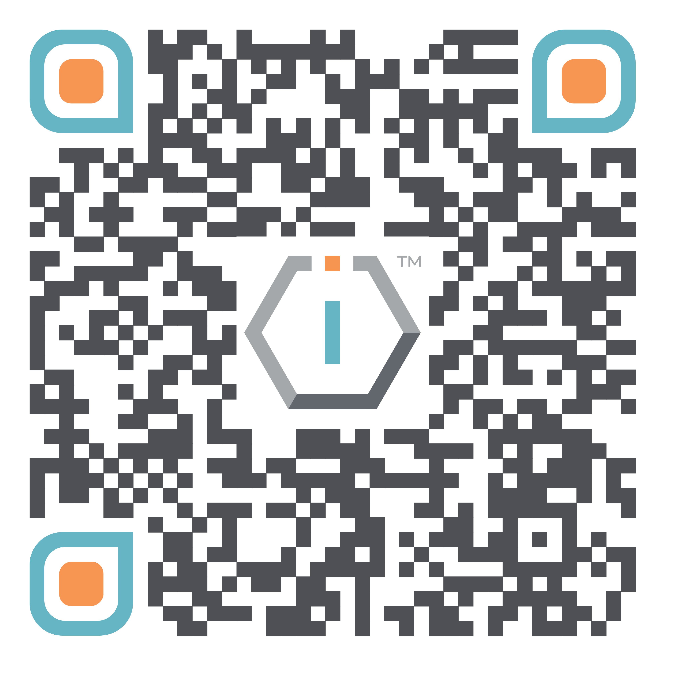

# 📊 Business Plan




[**ShortURL**](https://short.theiofoundation.org/TIOFBusinessPlan) **|&#x20;**~~**Playbook**~~**&#x20;|&#x20;**~~**Assistant**~~




Use this QR Code to quickly share this page.

<figure><figcaption>
QR Code of this page
</figcaption></figure>



## About

This section provides all the information about how The IO Foundation finances its advocacy and operations.

The organization actively attempts to balance traditional means of funding (donations, grants) with offering its own products and services aligned with the DCDR advocacy.


This business plan is fully compliant with [The IO Foundation's policies](https://short.theiofoundation.org/TIOFPolicies).


## **Funding streams**

In accordance to its Resource Mobilization and Allocation policy, The IO Foundation accepts resources from a variety of sources, categorized into streams, that are consistent with its Mission, Vision and values. The following are the recognized types of resource mobilization streams:

<table><thead><tr><th width="104">Icon</th><th>Stream</th><th>Description</th></tr></thead><tbody><tr><td>📰</td><td><strong>1 - Grants</strong></td><td>Financial support received from foundations, government entities or other organizations typically designated for specific projects or initiatives.</td></tr><tr><td>💶</td><td>2 - <strong>Donations</strong></td><td>Monetary or in-kind contributions provided voluntarily by individuals, corporations or institutions without expectation of direct return.</td></tr><tr><td>💷</td><td>3 - <strong>Crowdfunding</strong></td><td>Raising small amounts of money from a large number of people, typically via the Internet.</td></tr><tr><td>🎫</td><td>4 - <strong>Products &#x26; Services</strong> </td><td>Revenue generated from the provision of services and products that align with the organization's mission and expertise.</td></tr><tr><td>🌗</td><td>5 - <strong>Matching</strong></td><td>Funds matched by another party, often in response to funds raised through other means.</td></tr></tbody></table>

## **Unrestricted and Restricted resources**

In accordance to its [Finance Policy](https://short.theiofoundation.org/TIOFPoliciesFinance), The IO Foundation categorizes all mobilized resources into two distinct categories:

### **Unrestricted resources**

These resources can be used at the discretion of the organization for any project, program, or operational need. Unrestricted resources offer flexibility in their allocation and are vital for the proper functioning of the organization. These resources are typically sourced from general donations, revenue from products or services or grants that do not specify usage.

### **Restricted r**esources&#x20;

Restricted resources are those designated for specific purposes, as defined by the donor, crowdfunding project deliverables or grantor. These resources must be used strictly for the projects, programs or activities outlined in by the source's requirements.

## Budgeting

The IO Foundation establishes every season an budget plan for the upcoming season.&#x20;


This budget plan is fully compliant with [The IO Foundation's policies](https://short.theiofoundation.org/TIOFPolicies).


Budget plans are not currently made public (although it is on our roadmap) due to resource constraints.

Nonetheless, you can consult the organization's [Annual Reports](https://short.theiofoundation.org/TIOFAnnualReports) which are public.
