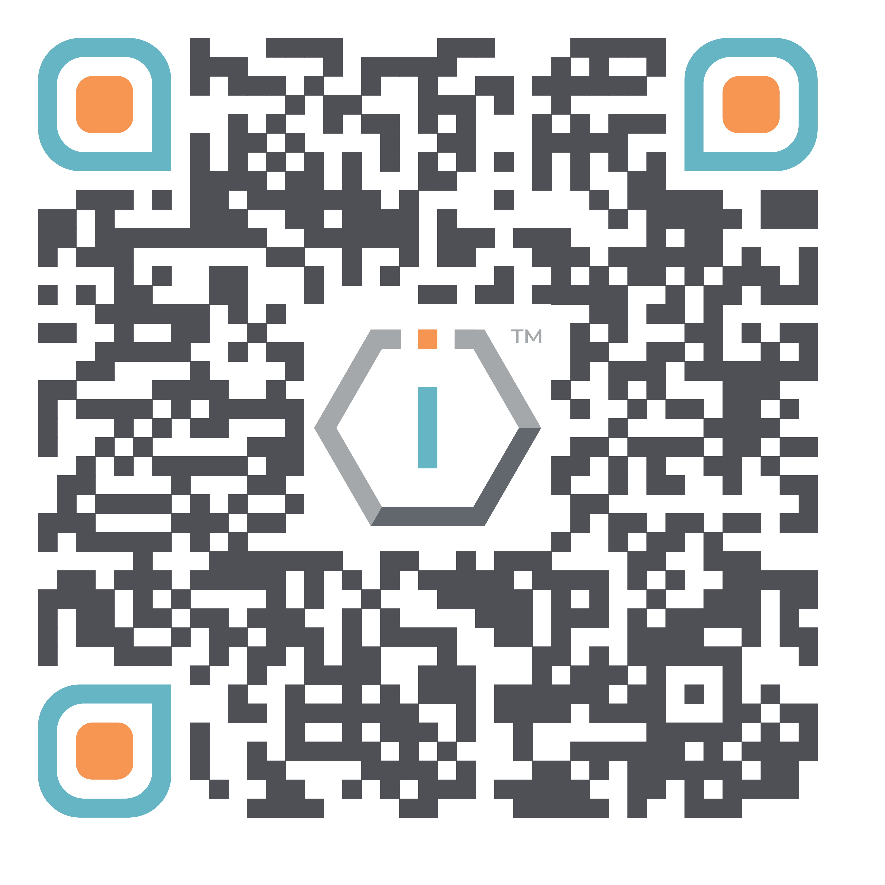

# Join us




[**ShortURL**](https://short.theiofoundation.org/DocsJoinTIOF) **| **~~**Playbook**~~** | **~~**Assistant**~~




Use this QR Code to quickly share this page.

<figure><figcaption>
QR Code of this page
</figcaption></figure>



## Joining The IO Foundation

The IO Foundation is always looking for talented individuals wishing to make an impact in technology.

Do you share our [vision](https://tiof.click/TIOFVision)?

Do you have a passion towards the development and support of the [Data-Centric Digital Rights advocacy](https://tiof.click/DCDRAdvocacy)?\
\
Do you want to participate in our [initiatives](https://tiof.click/TIOFInitiatives)?


**Together we can work towards protecting citizens' Data-Centric Digital Rights.**

**Let’s talk!**


## How can I contribute?

Contributing in The IO Foundation and its initiatives is easy!

There are 2 ways to proceed:

### Participate as a TIOF Member

By joining as a TIOF Member you will officially join one of the TIOF [Teams](broken-reference), participate in organized tasks and have access to tools and other resources as well as training.

TIOF Members can be:

* [Members of a Board](https://tiof.click/TIOFOrgChartDocs#members-of-a-board)
* [Employees](https://tiof.click/TIOFOrgChartDocs#employees)
* Associates (coming soon)
* Fellows (coming soon)
* Alumni (coming soon)
* [Interns](https://tiof.click/TIOFOrgChartDocs#interns)
* [Volunteers](https://tiof.click/TIOFOrgChartDocs#volunteers)


As an active TIOF Member, you must be able to commit according to the responsibilities acquired.

\
&#xNAN;_**Commitment means staying loyal to what you said you were going to do long after the mood you said it in has left you.**_

&#x20;                                                                                                                                                                      Orebela Gbenga


<table data-card-size="large" data-view="cards" data-full-width="false"><thead><tr><th></th><th data-hidden data-card-cover data-type="files"></th><th data-hidden data-card-target data-type="content-ref"></th></tr></thead><tbody><tr><td><mark style="color:orange;"><strong>Check the available positions @ The IO Foundation</strong></mark></td><td><a href="../../.gitbook/assets/image.png">image.png</a></td><td><a href="https://short.theiofoundation.org/TIOFJoinUs">https://Short.TheIOFoundation.org/TIOFJoinUs</a></td></tr></tbody></table>

### Participate as a Collaborator

It is not necessary to be a Member to participate and make a meaningful contribution to the DCDR advocacy. There are plenty of ways that you can support it without requiring to dive into its complexities.


Participating sporadically is also possible and always welcomed.


In response to your commitment towards our [values](https://tiof.click/TIOFValues) (and in the measure of our capacities), The IO Foundation publishes all ongoing tasks in its [public repository](https://short.theiofoundation.org/TIOFRepo).

Check out what are we up to and pick tasks you feel you can contribute with.


How to contribute on tasks? **Check the Tasks Handbook (coming soon).**


<table data-card-size="large" data-view="cards"><thead><tr><th></th><th data-hidden data-card-cover data-type="files"></th><th data-hidden data-card-target data-type="content-ref"></th></tr></thead><tbody><tr><td><mark style="color:orange;"><strong>Check the available tasks @ The IO Foundation</strong></mark></td><td><a href="../../.gitbook/assets/image (6).png">image (6).png</a></td><td><a href="https://short.theiofoundation.org/TIOFTasks">https://Short.TheIOFoundation.org/TIOFTasks</a></td></tr></tbody></table>
