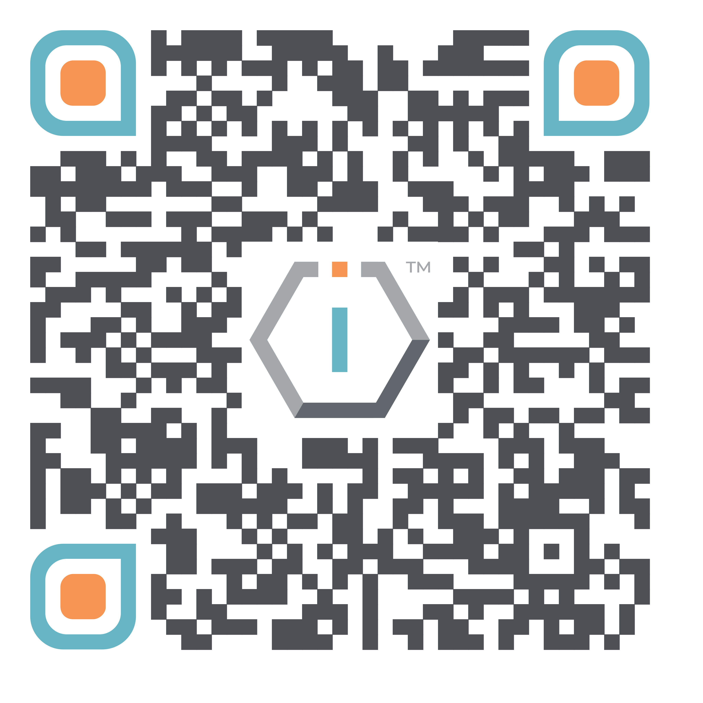

# Media Kit




[**ShortURL**](https://short.theiofoundation.org/TIOFDocsMediaKit) **|&#x20;**~~**Playbook**~~**&#x20;|&#x20;**~~**Assistant**~~




Use this QR Code to quickly share this page.

<figure><figcaption>
QR Code of this page
</figcaption></figure>



## Introduction

### About

This document describes all the elements that conform The IO Foundation's organization identity (aka Branding Guidelines) and their usage rules on any generated content, by either [TIOF Members](https://tiof.click/TIOFTerminology#members), [Contributors](https://tiof.click/TIOFTerminology#contributors) or any other third parties.

It is a reference document to which all TIOF productions, either for internal or external use, must refer and adhere.

You should familiarize yourself with this it and comply with it at all times. Any questions you may have with regard to its contents or what you have to do to comply with it should be referred to the corresponding Team Comms Manager.


A document summarizing The IO Foundation's [Branding Guidelines](https://github.com/TheIOFoundation/TIOF/raw/master/Project%20Identity/\[TIOF]%20Comms%20\[P]%20Branding%20Guidelines%20ENG%20v1.4.pdf) is also available.



**A full Media Kit set is available for download in** [**TIOF's Media Package**](https://tiof.click/TIOFPackageMedia)**.**


## Concepts

### Name

The following forms are authorized when referring to The IO Foundation:


{% column width="33.33333333333333%" %}
* The IO Foundation
* TIOF


{% column width="66.66666666666667%" %}

## REMARKS

* Please note the capitalization
* The article "The" is not optional nor it is inseparable from the rest of the name: ~~the IO Foundation~~ / ~~IO Foundation~~




### Mission & Vision

The following are the official formulations of The IO Foundation's Mission & Vision:

> **Mission:** `To promote, protect and provide solutions for Data-Centric Digital Rights.`

> **Vision:** `A world where Human Rights and Data-Centric Digital Rights are one and the same.`

### Values

The IO Foundation embraces the following values to drive its mission:

<table data-view="cards"><thead><tr><th></th><th></th></tr></thead><tbody><tr><td>
<i class="fa-bolt">:bolt:</i>  <strong>INNOVATIVE</strong>

      <strong>IMPACT</strong>
</td><td>
Our work only makes sense if we help digital users worldwide.

Our <a href="https://tiof.click/TIOFInitiatives">initiatives</a> are designed and implemented only to serve the broader <a href="https://tiof.click/DCDRAdvocacy">DCDR advocacy</a> and to help, step by step, generate practical outcomes that make technology better and safer transparently for digital citizens.
</td></tr><tr><td><i class="fa-eye">:eye:</i>  <strong>TRANSPARENCY</strong>        <strong>&#x26; ACCOUNTABILITY</strong></td><td>We recognize the critical importance of operating under procedures and methodologies that are transparent in order to generate the necessary trust in our <a href="https://tiof.click/DCDRPrinciples">DCDR Principles</a> and the advocacy at large. </td></tr><tr><td>
<i class="fa-users-rectangle">:users-rectangle:</i>  <strong>SUPPORTING</strong>

      <strong>COMMUNITY</strong>
</td><td><a href="https://tiof.click/DCDRAdvocacy">Data-Centric Digital Rights</a> is a global endeavor that requires the active participation of everyone, from policy makers to citizens, businesses and, most importantly technologists as architects and builders our digital societies. </td></tr></tbody></table>

### The advocacy

The IO Foundation's advocacy is called [Data-Centric Digital Rights](https://short.theiofoundation.org/TIOFDCDRDocs). The following forms are to be used internally in TIOF and highly encouraged when referring to the advocacy:



* Data-Centric Digital Rights
* DCDR




## REMARKS

Please note the capitalization.




**About the DCDR advocacy**

[Data-Centric Digital Rights](https://short.theiofoundation.org/TIOFDCDRDocs) advocates to establish the necessary technical standards to transparently protect citizen's [digital twins](https://tiof.click/DCDRTerminology#digital-twin) and enable technologists to create better and safer digital societies through embracing their role as [NextGen Rights Defenders](https://tiof.click/TIOFNextGen).


For more information on the DCDR advocacy, please refer to

* [DCDR Website](https://tiof.click/DCDRWeb)
* [DCDR Documentation](https://tiof.click/DCDRDocs)


#### Iconography

While there is currently no agreed-upon iconography for the Data-Centric Digital Rights, The IO Foundation uses the following assets: **\[WIP]**

### DCDR Principles


Find all the information on the [DCDR initiative's Media Kit](https://tiof.click/DCDRMediaKit).


### TIOF Members

The following is the official information about [the Humans](https://tiof.click/TIOFMembers) composing The IO Foundation.

You can also check the [TIOF's Organization Chart](https://tiof.click/TIOFOrgChart).

## Contents

### Descriptions

The following are the official definitions to be used when describing or referencing The IO Foundation and its DCDR advocacy. A number of variations are provided in an attempt to fit different character limitations.


When describing The IO Foundation, please use these official descriptions.


#### Full version

The IO Foundation (TIOF) is a global for-impact NGO advocating for Data-Centric Digital Rights. Born from a fundamental concern about the state of technology in the world, its mission is to `Promote, protect and provide solutions for Data-Centric Digital Rights`, thus enabling the implementation of better and safer digital societies.

As data becomes an increasingly powerful economic, political, and social force, _programmers are emerging as the next generation of Human and Digital Rights defenders_.

Following its vision of `A world where Human Rights and Digital Rights are one and the same`, TIOF aims to raise awareness of the importance of Data-Centric Digital Rights in collaboration with all stakeholders ranging from programmers, bodies of governance, civil society and corporate.

#### Mini version (under 300 characters)

The IO Foundation (TIOF) is a global for-impact NGO advocating for Data-Centric Digital Rights to establish a more solid approach to Rights from a technical standards perspective and to raise awareness on the critical role of programmers as the Next Generation of Human and Digital Rights defenders.

#### Micro version (under 160 characters)

TIOF is a for-impact NGO advocating for Data-Centric Digital Rights aiming to establish a more solid approach to Rights from a technical standards perspective.

#### Nano version (under 100 characters)

The IO Foundation is a global for-impact NGO advocating for Data-Centric Digital Rights (DCDR).

### Logos

The following are the official logos for The IO Foundation.

|                                                            |                                                                                         |                                                                                          |
| ---------------------------------------------------------- | --------------------------------------------------------------------------------------- | ---------------------------------------------------------------------------------------- |
| 
<strong>TIOF</strong> <strong>Full Logo</strong>
 | .png>) |     |
| 
<strong>TIOF</strong> <strong>Hex Logo</strong>
  |       | .png>) |
| **Format**                                                 | Full Color                                                                              | White Variant                                                                            |
| **Usage**                                                  | General use.                                                                            | Monochromatic or dark backgrounds.                                                       |


For more information, please refer to [TIOF's Branding Guidelines](https://tiof.click/BrandingKit).



**All logos are available for download in** [**TIOF's Media Package**](https://tiof.click/TIOFPackageMedia)**.**


### Fonts (typeface)

The official font for The IO Foundation content is Montserrat.


## **REMARKS**

Only in the event that the official font is not available (**and only if**), the following fonts can be used as alternatives and in this order

1. Helvetica
2. Arial



For more information, please refer to [TIOF's Branding Guidelines](https://tiof.click/BrandingKit).


### Color palette

The following are the official colors composing The IO Foundation's color palett&#x65;**.**

<table data-header-hidden><thead><tr><th width="150"></th><th width="150"></th><th width="150"></th><th width="150"></th></tr></thead><tbody><tr><td><strong>Color</strong></td><td><strong>Light gray</strong></td><td><strong>Dark gray</strong></td><td><strong>Orange</strong></td></tr><tr><td><strong>Code</strong></td><td>LG</td><td>DG</td><td>O</td></tr><tr><td><strong>Sample</strong></td><td></td><td></td><td></td></tr><tr><td><strong>RGB</strong></td><td>137, 137, 142</td><td>78, 80, 86</td><td>247, 149, 82</td></tr><tr><td><strong>HSL</strong></td><td>240, 2.2, 54.7</td><td>225, 4.9, 32.2</td><td>24, 91.2, 64.5</td></tr><tr><td><strong>Hex</strong></td><td>#89898E</td><td>#4E5056</td><td>#F79552</td></tr></tbody></table>

<table data-header-hidden><thead><tr><th width="189.48194984202962"></th><th width="186.29844531826296"></th><th width="150"></th><th></th></tr></thead><tbody><tr><td><strong>Color</strong></td><td><strong>Light blue</strong></td><td><strong>Dark blue</strong></td><td></td></tr><tr><td><strong>Code</strong></td><td>LB</td><td>DB</td><td></td></tr><tr><td><strong>Sample</strong></td><td></td><td></td><td></td></tr><tr><td><strong>RGB</strong></td><td>102, 181, 197</td><td>80, 145, 158</td><td></td></tr><tr><td><strong>HSL</strong></td><td>190, 45.0, 58.6</td><td>190, 32.8, 46.7</td><td></td></tr><tr><td><strong>Hex</strong></td><td>#66B5C5</td><td>#50919F</td><td></td></tr></tbody></table>


## REMARKS

Due to Google Calendar limitations, TIOF's [Public Event Calendar](https://tiof.click/EventsCal) uses their _Graphite_ color coding.



For more information, please refer to [TIOF's Branding Guidelines](https://tiof.click/BrandingKit).


### QR Codes

The following are the official QR Codes to link The IO Foundation's online resources.

|                                                                                |                                                                           |                                                                          |
| :----------------------------------------------------------------------------: | :-----------------------------------------------------------------------: | :----------------------------------------------------------------------: |
|  |  |  |
|                                  TIOF Website                                  |                                  Join Us                                  |                                  Donate                                  |

|                                                                                |                                                                              |                                                                                      |
| :----------------------------------------------------------------------------: | :--------------------------------------------------------------------------: | :----------------------------------------------------------------------------------: |
|  |  |  |
|                            Hey Big Tech declaration                            |                                Code of Conduct                               |                                   Dhatam House Rule                                  |


**All QR Codes are available for download in** [**TIOF's Media Package**](https://tiof.click/TIOFPackageMedia)**.**


### #Tags

The following are the official #Tags used by The IO Foundation in all of its Channels.

* \#TheIOFoundation (or #TIOF)
* \#Data-Centric-Digital-Rights (or #DCDR)
* \#HeyBigTech
* \#DhathamHouseRule
* \#RightsTech


Each [TIOF initiative](https://tiof.click/TIOFInitiatives) has its own set of #Tags.\
Please refer to the corresponding initiative's Media Kit for their #Tags list.


## Official Channels

The following are the official, sanctioned, Media Channels used by The IO Foundation for its outreach actions.


Any other Media Channel not listed here is to be considered not affiliated with TIOF and therefore any opinions expressed are not to be associated with TIOF.


### Official Website

The following is the official website for The IO Foundation and its initiatives.

<table data-header-hidden><thead><tr><th width="178.56812431847231"></th><th></th></tr></thead><tbody><tr><td><strong>URL</strong></td><td><a href="https://theiofoundation.org">https://TheIOFoundation.org</a></td></tr><tr><td><strong>Alternative URLs</strong></td><td><a href="https://theiofoundation.com">.com</a> <a href="https://theiofoundation.net">.net</a> <a href="https://theiofoundation.eu">.eu</a> <a href="https://theiofoundation.asia">.asia</a></td></tr><tr><td><strong>Short URL</strong></td><td><a href="https://tiof.click/TIOFWeb">https://TIOF.Click/TIOFWeb</a></td></tr><tr><td><strong>Contents</strong></td><td>Publishing of general information about TIOF and its advocacy + Initiatives Presentation + Publications + Events</td></tr><tr><td><strong>Usage</strong></td><td>Primary reference to The IO Foundation</td></tr></tbody></table>

### Official Documentation

The following is the official documentation site for The IO Foundation and its initiatives.

<table data-header-hidden><thead><tr><th width="178.56812431847231"></th><th></th></tr></thead><tbody><tr><td><strong>URL</strong></td><td><a href="https://docs.theiofoundation.org">https://Docs.TheIOFoundation.org</a></td></tr><tr><td><strong>Alternative URLs</strong></td><td>None</td></tr><tr><td><strong>Short URL</strong></td><td><a href="https://tiof.click/TIOFDocs">https://TIOF.Click/TIOFDocs</a></td></tr><tr><td><strong>Contents</strong></td><td>Publishing of all documentation (policies, handbooks, operations and others) relative to The IO Foundation.</td></tr></tbody></table>

### URL Shorteners

The following are the official URL shortener domains used by The IO Foundation.

| **URL**              | [https://TIOF.Click](https://tiof.click)         | [https://DoThe.Click](https://dothe.click)                                 |
| -------------------- | ------------------------------------------------ | -------------------------------------------------------------------------- |
| **Alternative URLs** | None                                             | None                                                                       |
| **Short URL**        | N/A                                              | N/A                                                                        |
| **Usage**            | Shorten URLs related to TIOF and its initiatives | Shorten URLs related to other organizations or projects that TIOF supports |


Check here the full catalogue of [TIOF's shortURLs](https://tiof.click/shortURLs).


### Organization's Repository

The following are the official repositories used by The IO Foundation.

<table data-header-hidden><thead><tr><th width="168.40434927892022"></th><th width="150"></th><th></th></tr></thead><tbody><tr><td><strong>Type</strong></td><td><a href="http://tiof.click/TIOFGitHub">TIOF Profile on GH</a></td><td><a href="http://tiof.click/TIOFRepo">TIOF Repository on GH</a></td></tr><tr><td><strong>Alternative URLs</strong></td><td>None</td><td>None</td></tr><tr><td><strong>Short URL</strong></td><td><a href="https://tiof.click/TIOFGitHub">https://TIOF.Click/TIOFGitHub</a></td><td><a href="https://tiof.click/TIOFRepo">https://TIOF.Click/TIOFRepo</a></td></tr><tr><td><strong>Full URL</strong></td><td><a href="https://github.com/TheIOFoundation/">https://github.com/TheIOFoundation/</a></td><td><a href="https://github.com/TheIOFoundation/TIOF">https://github.com/TheIOFoundation/TIOF</a></td></tr><tr><td><strong>Content</strong></td><td>Official profile of TIOF in GitHub.</td><td>Public repository showcasing TIOF's work.</td></tr><tr><td><strong>Usage</strong></td><td>Consolidation of all GH presence for TIOF.</td><td>Organization Management + Community Collaboration + Transparency platform</td></tr></tbody></table>

### Email

The following are the official email domains used by The IO Foundation.


Only email received from these domains are to be considered originated by TIOF or its members.


<table data-header-hidden><thead><tr><th width="150"></th><th></th></tr></thead><tbody><tr><td><strong>Domains</strong></td><td>@TheIOFoundation.org</td></tr><tr><td><strong>Alternative Domains</strong></td><td>None</td></tr><tr><td><strong>Usage</strong></td><td>Official communications from TIOF Members both internally and externally.</td></tr></tbody></table>

The following are the official public email addresses used by The IO Foundation.

<table><thead><tr><th width="285">Email</th><th>Usage</th></tr></thead><tbody><tr><td><a href="mailto://Contact@TheIOFoundation.org">Contact@TheIOFoundation.org</a></td><td>Official communications and inquiries</td></tr><tr><td><a href="mailto://Media@TheIOFoundation.org">Media@TheIOFoundation.org</a></td><td>Media related communications and inquiries</td></tr><tr><td><a href="mailto:Sales@TheIOFoundation.org">Sales@TheIOFoundation.org</a></td><td>Sales related communications and inquiries</td></tr></tbody></table>

### Social Media

The following are the official social media platforms where The IO Foundation has some sort of active presence.


The IO Foundation, in general, uses social media reluctantly.

To learn more about TIOF's position on this matter, check our [Hey Big Tech! declaration.](https://tiof.click/HeyBigTech)


<table><thead><tr><th width="146">Channels</th><th width="164">@Handle</th><th>Full URL</th><th>ShortURL</th></tr></thead><tbody><tr><td>LinkedIn</td><td>@<a href="https://www.linkedin.com/company/the-io-foundation">the-io-foundation</a></td><td><a href="https://www.linkedin.com/company/the-io-foundation">https://www.linkedin.com/company/the-io-foundation/</a></td><td><a href="https://short.theiofoundation.org/TIOFChannelLinkedIn">https://Short.TheIOFoundation.org/TIOFChannelLinkedIn</a></td></tr><tr><td>X  (former Twitter)</td><td>@<a href="https://twitter.com/TheIOFoundation">TheIOFoundation</a></td><td><a href="https://twitter.com/TheIOFoundation">https://twitter.com/TheIOFoundation/</a></td><td><a href="https://short.theiofoundation.org/TIOFChannelX">https://Short.TheIOFoundation.org/TIOFChannelX</a></td></tr><tr><td>Facebook</td><td>@<a href="https://www.facebook.com/TheI0Foundation/">TheI0Foundation</a></td><td><a href="https://www.facebook.com/TheI0Foundation/">https://www.facebook.com/TheI0Foundation/</a></td><td><a href="https://short.theiofoundation.org/TIOFChannelFaceboook">https://Short.TheIOFoundation.org/TIOFChannelFaceboook</a></td></tr><tr><td>Instagram</td><td>@<a href="https://www.instagram.com/theiofoundation/">theiofoundation</a></td><td><a href="https://www.instagram.com/theiofoundation/">https://www.instagram.com/theiofoundation/</a></td><td><a href="https://short.theiofoundation.org/TIOFChannelInstagram">https://Short.TheIOFoundation.org/TIOFChannelInstagram</a></td></tr><tr><td>Youtube</td><td>@<a href="https://www.youtube.com/@TheIOFoundation/">TheIOFoundation</a></td><td><a href="https://www.youtube.com/@TheIOFoundation/">https://www.youtube.com/@TheIOFoundation/</a></td><td><a href="https://short.theiofoundation.org/TIOFChannelYoutube">https://Short.TheIOFoundation.org/TIOFChannelYoutube</a></td></tr><tr><td>Rumble</td><td></td><td><a href="https://rumble.com/c/c-1383496">https://rumble.com/c/c-1383496</a></td><td><a href="https://short.theiofoundation.org/TIOFChannelRumble">https://Short.TheIOFoundation.org/TIOFChannelRumble</a></td></tr></tbody></table>


## REMARKS

The IO Foundation has profiles in other platforms, sometimes in preparation for its use, sometimes to avoid impersonation.


### Calendars

The following is the official calendar through which The IO Foundation publishes events:

* organized by TIOF (under [TechUp](https://tiof.click/TUDocs))
* those it may participate in
* other events that are deemed relevant

| **Platform**  | Google Calendar                                              |
| ------------- | ------------------------------------------------------------ |
| **Short URL** | [https://TIOF.Click/EventsCal](https://tiof.click/EventsCal) |
| **Content**   | Events calendar                                              |
| **Usage**     | Public events calendar                                       |

### Human Resources

The following is the official recruitment platform through which The IO Foundation publishes its open positions.

| **Platform**  | Hirevire                                                                                     |
| ------------- | -------------------------------------------------------------------------------------------- |
| **Full URL**  | [https://Join.TheIOFoundation.org](https://join.theiofoundation.org)                         |
| **Short URL** | [https://Short.TheIOFoundation.org/TIOFJoinUs](https://short.theiofoundation.org/TIOFJoinUs) |
| **Content**   | Posting of open positions for TIOF                                                           |
