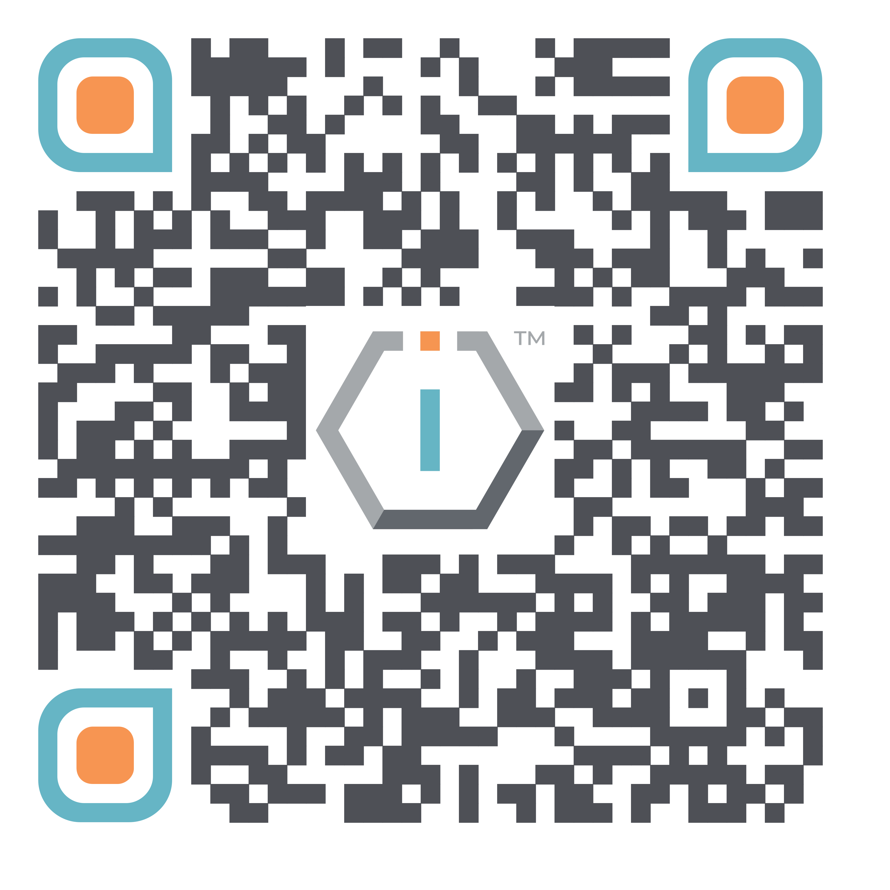

# New Version




[**ShortURL**](https://short.theiofoundation.org/TIOFDocsOrgBrief) **| **~~**Playbook**~~** | **~~**Assistant**~~




Use this QR Code to quickly share this page.

<figure><figcaption>
QR Code of this page
</figcaption></figure>




{% column width="58.333333333333336%" %}
## The organization

The IO Foundation (TIOF) is a global for-impact NGO born from a fundamental concern about the state of technology in the world and advocating for [Data-Centric Digital Rights](https://tiof.click/DCDRAdvocacy).

TIOF aims to raise awareness of the importance of [Data-Centric Digital Rights](https://tiof.click/DCDRAdvocacy) in collaboration with stakeholders ranging from civil society, programmer communities, bodies of governance and corporate and work together to achieve the proclamation and adoption of a [Universal Declaration of Digital Rights](https://tiof.click/UDDRWeb).

TIOF advances its [Data-Centric Digital Rights advocacy](https://tiof.click/DCDRAdvocacy) through the implementation of a number of [initiatives](new-version.md#initiatives).

The IO Foundation is a global for-impact NGO championing Data-Centric Digital Rights to strengthen user protection through technical standards. Our work focuses on supporting technologists, the architects of modern civilization, to safeguard human and digital rights by advocating for robust digital infrastructure.

Actively engaged in Standard Developing Organizations, such as the IETF, the ITU and ICANN, we raise awareness of their critical role within the technical community both locally and globally. Recognizing technologists as the next generation of rights defenders, we equip them through workshops and fellowships with the tools and knowledge to shape secure, ethical digital systems.

Our mission is driven by innovation and accountability, ensuring technology serves humanity’s progress.



{% column width="41.666666666666664%" %}

As core stakeholders, technologists play a critical role as the [Next Generation of Rights Defenders](https://tiof.click/TIOFNextGen) and need to orient themselves through new design and implementation paradigms focused on protecting data. The [DCDR Principles](https://tiof.click/DCDRPrinciples) are concepts that help them navigate the intricacies of applying Human and Digital Rights in digital infrastructures, products and services.






{% column width="50%" %}
## The challenge

* The nature of data is largely misunderstood
  * With currently 11 definitions of data worldwide, if we can't agree on that basic concept it will be virtually impossible to protect it effectively cross-borders.
* Technology is too complex for citizens and doesn't protect them properly
  * Current regulations place too much burden on the citizens' shoulders.
* Technology, and in particular software, does not have a way to prove compliance to data protection laws in an objective, standardized manner
  * In any properly regulated industry, companies only compete at value proposition level. In technology, they also compete at compliance level; enduring trust is not possible.&#x20;


{% column width="50%" %}
##

* Experts do not have the necessary tools to be at the forefront of architecting and implementing better and safer technology
  * Policy makers and civil society at large keeps ignoring that engineers require being spoken too in a language they understand: clear, precise and definable problems + algorithms.
* Citizens should only be expected to be responsible citizens and not hackers
* Governments are increasingly becoming irrelevant by not being able to protect their own citizens' data




At The IO Foundation we regard technologists, and developers in particular, as the \
&#xNAN;_&#x4E;ext Generation of Rights Defenders._


## Initiatives

The IO Foundation organizes its work around a set of Initiatives, each of them designed to bring about the changes in the tech ecosystem that shall protect the final user by design.



<figure><figcaption></figcaption></figure>

###  Data-Centric Digital Rights

TIOF views the technology as currently non-correlated with all working understandings and practices as to how any public-consumption industry functions traditionally where a clear separation is made between:

* Experts, who understand the complexities to design and build products that are compliant with applicable legislation and
* Citizens, who are solely tasked for being responsible users of the product

In essence, DCDR is a framework for technologists composed by Principles, Taxonomies and other technical tools. It enables them to develop a deeper understanding about the nature of data, the digital twins that emerge from it and make possible for them to embrace their role as [NextGen Rights Defenders](https://tiof.click/TIOFNextGen).





By understanding that [_we are our data_](https://tiof.click/DCDRPrinciple1), technologists may architect Digital Spaces that aim at [_ending remedy_](https://tiof.click/DCDRPrinciple2) and build it so that they implement [_Rights by design_](https://tiof.click/DCDRPrinciple3).


#### Objectives

DCDR aims at encouraging a shift in the current technology paradigms by providing a [DCDR framework](https://tiof.click/DCDRFramework) comprised of, among others:

* A set of[ DCDR Principles](https://tiof.click/DCDRPrinciples)
* An oath [(the Sagan Oath)](https://tiof.click/DCDRSaganOath)
* A set of taxonomies for
  * [Digital Harms](https://tiof.click/DCDRDigitalHarms)
  * [Digital Rights](https://tiof.click/DCDRDigitalRights)
  * [Use Cases](https://tiof.click/DCDRUseCases)

[More information](https://tiof.click/DCDRDocs)

#### Related Projects






The BHR in Tech initiative aims at encouraging a shift towards the adoption and implementation of the [United Nations' Guiding Principles in Business and Human Rights](https://tiof.click/BITUNGP) in the Tech sector by

* designing and producing implementation guidelines and other research materials
* participating actively in the drafting of National Action Plans (NAPs) so that tech is considered as a thematic area or, to the very least, as a cross-cutting theme
* increase the recognition of the importance of technology in different jurisdictions through their National Action Plans
* reviewing existing National Action Plans (NAPs)&#x20;
* increase awareness and adoption across tech companies

[More information](https://tiof.click/BiTDocs)



<figure><figcaption></figcaption></figure>

### BHR in Tech

#### Related Projects





<figure><figcaption></figcaption></figure>

#### Related Projects




###  TechUp

TechUp is a collaborative space uniting capacity building and social participation to build better and safer digital by engaging technologists in a meaningful way.

Through its activities, TechUp strives to bring together the tech community to become the agents of change that digital societies need right now.

[More information](https://tiof.click/TUDocs)





###  Universal Declaration of Digital Rights

The UDDR initiative is a multi-stakeholder initiative promoted by The IO Foundation to promote and achieve the proclamation of a Universal Declaration of Digital Rights.

> _**Building trustworthy technology that protects your Data-Centric Digital Rights.**_


As core stakeholders, technologists play a critical role as the [Next Generation of Rights Defenders](https://tiof.click/TIOFNextGen) and need to orient themselves through new design and implementation paradigms focused on protecting data. The [DCDR Principles](https://tiof.click/DCDRPrinciples) put forward by The IO Foundation are concepts that help them navigate the intricacies of applying Human and Digital Rights in digital infrastructures, products and services.


[More information](https://tiof.click/UDDRDocs)



<figure><figcaption></figcaption></figure>

#### Objectives

The UDDR initiative aims at encouraging a shift in the current technology paradigms by providing

* a Universal Declaration of Digital Rights comprising
  * a Legal document (L)
  * a Technical document (T)
  * a Data-Centric Digital Rights SDK (DCDR SDK)
* a DCDR Processing Index
* a Global DCDR compliance database
* a strategy for international & national adoption and legislation strategies
* conversations on the different adoption strategies per stakeholder
* a strategy for the implementation, adoption, deployment and maintenance phases by the tech sector
* a roadmap for the above activities






<figure><figcaption></figcaption></figure>

#### Related Projects




###  CrowdShape

The CrowdShape (CS) initiative intends to be a model for crowd collaboration based on transparent processes and accountable management. It is aimed at enabling technologists to start and run their own tech NGOs by providing familiar tools to enable the collaboration and reward of participants, attracting talent and financial support.

[More information](https://tiof.click/CSDocs)



## Theory of Change

The following Theory of Change diagram provides an overview on how each of the initiatives support each other to advance TIOF's [Mission](https://tiof.click/TIOFMission) in realizing its [Vision](https://tiof.click/TIOFVision).



## What we produce

<table data-card-size="large" data-view="cards"><thead><tr><th></th></tr></thead><tbody><tr><td>Activities</td></tr><tr><td>Publications For more information, <a href="https://tiof.click/TIOFPublications">see TIOF's publications</a>.</td></tr><tr><td>Products</td></tr><tr><td>Services</td></tr></tbody></table>

## Our Commitment

Do things as an NGO yet not business as usual.\
We are committed to support the NGO sector to become more transparent and accountable.\
\>> Hexogate

