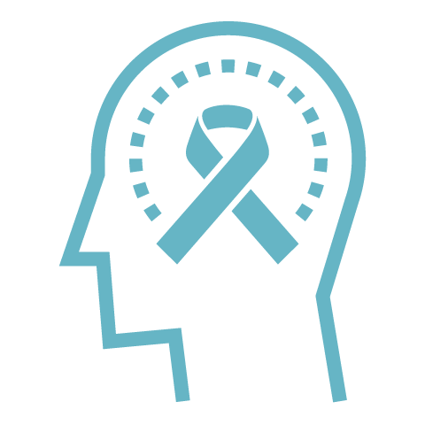

# 🔠 Portfolio


**ShortURL | Playbook | Assistant**


## Programs

The IO Foundation's programs are dedicated to advocating for Data-Centric Digital Rights and promoting the responsible design and user of technology in alignment with the DCDR Principles. These programs encompass a range of Initiatives and Projects, focusing on areas such as technical standards, policy development, education and community engagement.

Every Initiative is composed of a combination of activities under the following 3 Programs:

###  Strategic

The Strategic program implements for the long-term protection of Data-Centric Digital Rights by influencing technical standards and policies at various levels. These actions are directed towards ensuring that societies demand appropriate technical standards and policies for the observance of these rights, guided by the Universal Declaration of Digital Rights as the ultimate strategic document.

###  Awareness

The Awareness program focuses on activities designed to enhance understanding and literacy in Data-Centric Digital Rights, educating citizens (technologists and users alike) on their importance for effective self-protection in the digital realm. Its primary goal is to heighten awareness and responsiveness towards these rights, fostering a deeper commitment to respecting and safeguarding the DCDR Principles within the digital space.

###  Engagement

The Engagement program, advancing beyond awareness, encompasses activities that develop technological solutions addressing current and future challenges in the digital realm. These activities are specifically designed to offer practical solutions for the challenges citizens encounter in protecting their Data-Centric Digital Rights, either as builders or as users.

## Initiatives & Projects

The IO Foundation advances its [Data-Centric Digital Rights advocacy](https://tiof.click/DCDRAdvocacy) through the implementation of a number of initiatives.

The following diagram provides an overview on how each of the initiatives support each other to advance TIOF's [Mission](https://tiof.click/TIOFMission) in realizing its [Vision](https://tiof.click/TIOFVision).



###  Data-Centric Digital Rights

Advancing the supporting the DCDR advocacy through research and knowledge dissemination.

[Get involved](https://tiof.click/DCDRDocs)

**List of projects under this Initiative:**

<table><thead><tr><th>Name</th><th>Code</th><th>Summary</th><th>Status<select><option value="f2c4d22c55244665a263ef75a54e35a1" label="Active" color="blue"></option><option value="c95e101e4d6a4cc0b2ebca5eb0f49a0a" label="Paused" color="blue"></option><option value="479b1dccbb2e4796a19f7b9667756bab" label="Finished" color="blue"></option><option value="c81cdc122abb4982911c470369196dd7" label="Design" color="blue"></option></select></th></tr></thead><tbody><tr><td>DCDR Framework</td><td>DCDR-FW</td><td>Theoretical working framework for applied DCDR.</td><td>Active</td></tr><tr><td>Codefield</td><td>DCDR-CF</td><td>Campaigns to enhance awareness about DCDR.</td><td>Active</td></tr><tr><td>First, we take your data</td><td>DCDR-1D</td><td>More information soon.</td><td>Design</td></tr></tbody></table>

###  BHR in Tech

Supporting the adoption and implementation of the [United Nations' Guiding Principles on Business and Human Rights](https://dothe.click/Ext6) in the Tech sector.

[Get involved](https://tiof.click/BiTDocs)

**List of projects under this Initiative:**

<table><thead><tr><th>Name</th><th>Code</th><th>Summary</th><th>Status<select><option value="f2c4d22c55244665a263ef75a54e35a1" label="Active" color="blue"></option><option value="c95e101e4d6a4cc0b2ebca5eb0f49a0a" label="Paused" color="blue"></option><option value="479b1dccbb2e4796a19f7b9667756bab" label="Finished" color="blue"></option><option value="c81cdc122abb4982911c470369196dd7" label="Design" color="blue"></option></select></th></tr></thead><tbody><tr><td>ProtocolWatch</td><td>BiT.PW</td><td>Monitoring SDOs to counter authoritarian actions.</td><td>Active</td></tr><tr><td>RepairSafe</td><td>BiT-RS</td><td>More information soon.</td><td>Design</td></tr><tr><td>BHR in Tech in MY</td><td>BiT.MY</td><td><em>Technology</em> as cross-cutting issue on Malaysia's NAP.</td><td>Finished</td></tr></tbody></table>

###  TechUp

Supporting programmers as the Next Generation of Rights defenders for our digital societies.

[Get involved](https://tiof.click/TUDocs)

**List of projects under this Initiative:**

<table><thead><tr><th>Name</th><th>Code</th><th>Summary</th><th>Status<select><option value="f2c4d22c55244665a263ef75a54e35a1" label="Active" color="blue"></option><option value="c95e101e4d6a4cc0b2ebca5eb0f49a0a" label="Paused" color="blue"></option><option value="479b1dccbb2e4796a19f7b9667756bab" label="Finished" color="blue"></option><option value="c81cdc122abb4982911c470369196dd7" label="Design" color="blue"></option></select></th></tr></thead><tbody><tr><td>TU Fellowship</td><td>TU-FE</td><td>Training the Next Generation of Rights Defenders.</td><td>Active</td></tr><tr><td>Coder Network</td><td>TU-CN</td><td>More information soon.</td><td>Design</td></tr><tr><td>::Assembly</td><td>TU-ASM</td><td>More information soon.</td><td>Design</td></tr></tbody></table>

###  CrowdShape

A platform to support technologists wanting to make and impact and support the growth of the Tech NGO ecosystem by quickly and efficiently bootstrap their own Tech NGO.

[Get involved](https://tiof.click/CSDocs)

**List of projects under this Initiative:**

<table><thead><tr><th>Name</th><th>Code</th><th>Summary</th><th>Status<select><option value="f2c4d22c55244665a263ef75a54e35a1" label="Active" color="blue"></option><option value="c95e101e4d6a4cc0b2ebca5eb0f49a0a" label="Paused" color="blue"></option><option value="479b1dccbb2e4796a19f7b9667756bab" label="Finished" color="blue"></option><option value="c81cdc122abb4982911c470369196dd7" label="Design" color="blue"></option></select></th></tr></thead><tbody><tr><td>Platform</td><td>CS-PLT</td><td>More information soon.</td><td>Design</td></tr></tbody></table>

###  Project Lockdown

A civic tech, interactive platform providing an overview of the state of Human and Digital Rights around the globe by monitoring the impact of governments' policies

[Get involved](https://tiof.click/PLDDocs)

**List of projects under this Initiative:**

<table><thead><tr><th>Name</th><th>Code</th><th>Summary</th><th>Status<select><option value="f2c4d22c55244665a263ef75a54e35a1" label="Active" color="blue"></option><option value="c95e101e4d6a4cc0b2ebca5eb0f49a0a" label="Paused" color="blue"></option><option value="479b1dccbb2e4796a19f7b9667756bab" label="Finished" color="blue"></option><option value="c81cdc122abb4982911c470369196dd7" label="Design" color="blue"></option></select></th></tr></thead><tbody><tr><td>Platform</td><td>PLD-PLT</td><td>Monitoring of NPIs and their impact on Rights.</td><td>Finished</td></tr></tbody></table>

###  Universal Declaration of Digital Rights

Advancing the development, proclamation and adoption of a Universal Declaration of Digital Rights.

[Get involved](https://tiof.click/UDDRDocs)

**List of projects under this Initiative:**

<table><thead><tr><th>Name</th><th>Code</th><th>Summary</th><th>Status<select><option value="f2c4d22c55244665a263ef75a54e35a1" label="Active" color="blue"></option><option value="c95e101e4d6a4cc0b2ebca5eb0f49a0a" label="Paused" color="blue"></option><option value="479b1dccbb2e4796a19f7b9667756bab" label="Finished" color="blue"></option><option value="c81cdc122abb4982911c470369196dd7" label="Design" color="blue"></option></select></th></tr></thead><tbody><tr><td>UDDR - Doc L</td><td>UDDR-DOCL</td><td>Legal document of the UDDR.</td><td>Active</td></tr><tr><td>UDDR - Doc T</td><td>UDDR-DOCT</td><td>More information soon.</td><td>Design</td></tr><tr><td>UDDR SDK</td><td>UDDR-SDK</td><td>More information soon.</td><td>Design</td></tr></tbody></table>

