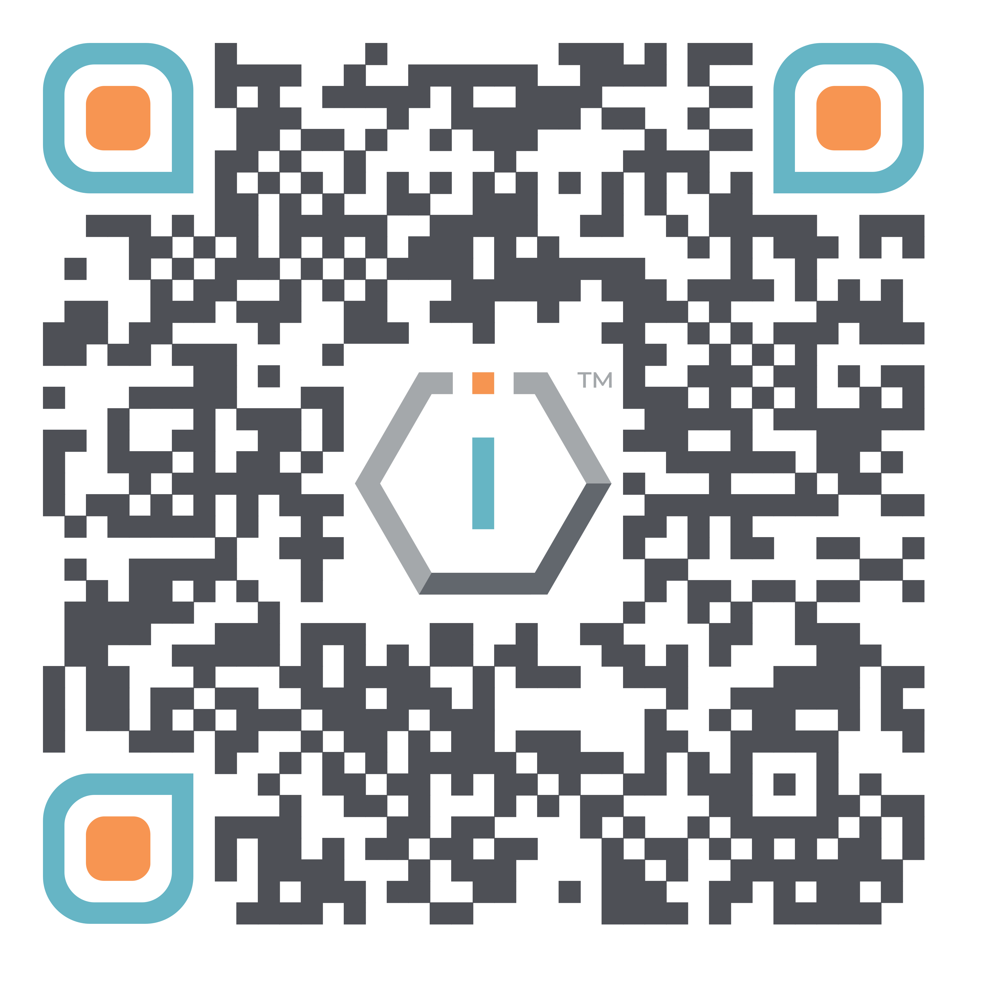

# 💰 Support Us




[**ShortURL**](https://short.theiofoundation.org/TIOFDocsSupportUs) **|&#x20;**~~**Playbook**~~**&#x20;|&#x20;**~~**Assistant**~~




Use this QR Code to quickly share this page.

<figure><figcaption>
QR Code of this page
</figcaption></figure>



## Supporting TIOF

The IO Foundation relies on funding support to advance its [DCDR advocacy](https://tiof.click/DCDRAdvocacy) and develop its [initiatives](https://tiof.click/TIOFInitiatives).

Your contribution goes straight to our work ensuring new technologies are architected and built to protect digital citizens.


**We thank you for your support and for helping making possible a world where Human Rights and Data-Centric Digital Rights are one and the same.**



**IMPORTANT**

As per The IO Foundation's [Funding Policy](https://tiof.click/TIOFPolicyFunding), please note that donations are made without strings attached.

TIOF is an independent civil society organization and will remain so regardless of the contributions received and their origin.


### Fiat currencies

You can donate using fiat currencies.\
(We are updating our donation platform - Thank you for your patience.)

### Crypto currencies

You can donate using crypto currencies.\
(Coming soon)
