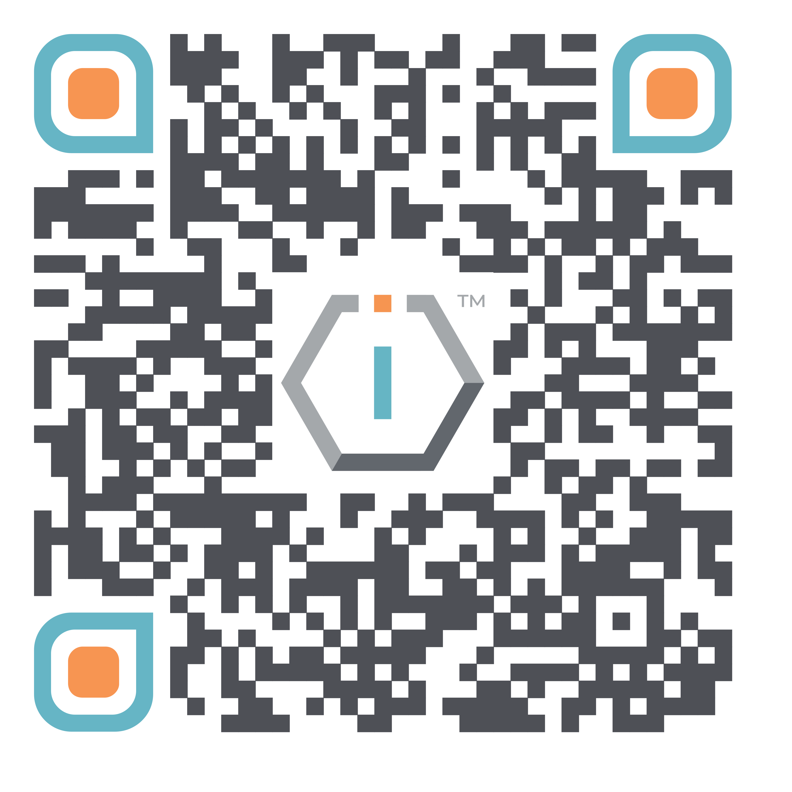

# 📜 Policies




[**ShortURL**](https://short.theiofoundation.org/TIOFPolicies) **|&#x20;**~~**Playbook**~~**&#x20;|&#x20;**~~**Assistant**~~




Use this QR Code to quickly share this page.

<figure><figcaption>
QR Code of this page
</figcaption></figure>



## About

This section contains the list of Policies that guide The IO Foundation as an organization in order to achieve its Mission and realize its Vision.

## Guiding values

The IO Foundation’s policy framework is a tapestry woven with the threads of European Enlightenment, a period marked by the burgeoning of reason, individualism and a pursuit for knowledge. Our policies are constructed upon a foundation of timeless values that have been pivotal in shaping modern societies.


**Humanism and the Value of human life:**  We emphasize the importance of each individual's dignity and worth by cherishing the intrinsic value of human life, human rights and equality of opportunity.



**Individual Liberties and Autonomy:** We respect individual autonomy, fostering freedom of expression, promoting freedom of thought and upholding the presumption of innocence to reflect our commitment to personal freedoms and civil liberties.



**Rationality and Empiricism:** We uphold objective reality by embracing the scientific method and the encouragement of empirical evidence. We highlight a focus on reason, scientific inquiry and evidence-based understanding as foundations for knowledge and policy.


These cornerstone values underpin our commitment to devising solutions that are effective and human-centric as much as technically robust and anchored in the bedrock of objective reality.

## Policies

The following is a list of the existing policies guiding The IO Foundation. Each policy is described in its own separate document.

<table><thead><tr><th>Global Policy</th><th>Summary</th><th data-hidden>Description</th><th data-hidden>Localized Policies</th><th data-hidden>Code</th></tr></thead><tbody><tr><td><a href="https://tiof.click/Dhatham">Dhatham House Rule</a></td><td>An evolution from the <a href="https://dothe.click/Ext5">CHATHAM House Rule</a> in response to the new digital realities that is used in all activities by The IO Foundation.</td><td></td><td></td><td></td></tr><tr><td><a href="https://tiof.click/TIOFPolicyCoC">Code of Conduct</a></td><td>Outlines the set of rules and guidelines for expected behavior and ethical standards for TIOF Members, TIOF Collaborators and anyone involved in activities by The IO Foundation to ensure respectful, responsible and lawful interactions.</td><td></td><td></td><td></td></tr><tr><td><a href="https://tiof.click/TIOFPolicyACAB">Anti corruption &#x26; Anti bribery</a></td><td>Outlines The IO Foundation's zero-tolerance policy towards bribery and corruption, specifying definitions, scope, procedures and guidelines for reporting and handling such incidents.</td><td></td><td></td><td>ACAB</td></tr><tr><td><a href="https://tiof.click/TIOFPolicyAHAB">Anti harassment &#x26; Anti bullying</a></td><td>Outlines The IO Foundation's policies and procedures against harassment and bullying, including definitions, scope, reporting mechanisms and disciplinary actions for violations.</td><td></td><td></td><td></td></tr><tr><td><a href="https://tiof.click/TIOFPolicyAT">Antiterrorism</a></td><td>Outlines measures and procedures to prevent, detect and respond to terrorism-related activities that The IO Foundation needs be aware of.</td><td></td><td></td><td></td></tr><tr><td><a href="https://tiof.click/TIOFPolicyCP">Children Protection</a></td><td>Sets out The IO Foundation's guidelines and procedures to safeguard children from abuse, exploitation and harm, ensuring their safety and well-being.</td><td></td><td></td><td></td></tr><tr><td><a href="https://tiof.click/TIOFPolicyCoI">Conflict of Interest</a></td><td>Outlines The IO Foundation's policy on identifying, disclosing, and managing conflicts of interest among its directors, officers and other members.</td><td></td><td></td><td></td></tr><tr><td><a href="https://tiof.click/TIOFPolicyEconS">Economic Sanctions</a></td><td>
Outlines The IO Foundation's policies

to ensure compliance with national and international sanctions laws, prohibiting transactions or partnerships with sanctioned individuals, entities or countries.
</td><td></td><td></td><td></td></tr><tr><td><a href="https://tiof.click/TIOFPolicyEO">Equal Opportunities</a></td><td>Outlines The IO Foundation's commitment to equal opportunities and non-discrimination in all aspects of employment, including recruitment, training and promotion.</td><td></td><td></td><td></td></tr><tr><td><a href="https://tiof.click/TIOFPolicyHS">Health and Safety</a></td><td>Outlines The IO Foundation's commitment to health and safety, detailing responsibilities, procedures and guidelines for ensuring a safe working environment for all TIOF Members and Contributors.</td><td></td><td></td><td></td></tr><tr><td><a href="https://short.theiofoundation.org/PoliciesPPDP">Personal Privacy and Data Protection</a></td><td>Outlines The IO Foundation's procedures to safeguard personal information, ensuring it is collected, processed and stored securely and lawfully, while protecting individuals' privacy rights in compliance with relevant data protection laws.</td><td></td><td></td><td></td></tr><tr><td><a href="https://tiof.click/TIOFPolicySA">Sickness Absence</a></td><td>Outlines The IO Foundation's stance on sickness absence, including procedures for reporting, evidence of incapacity, sick pay arrangements and handling long-term or persistent absence.</td><td></td><td></td><td></td></tr><tr><td><a href="https://tiof.click/TIOFPolicyWhistleblowing">Whistleblowing</a></td><td>Outlines the procedures and protections for reporting suspected wrongdoing within The IO Foundation, emphasizing confidentiality, standards and the safeguarding of whistleblowers against retaliation.</td><td>Outlines the procedures and protections for reporting suspected wrongdoing within The IO Foundation, emphasizing confidentiality, standards and safeguarding whistleblowers against retaliation.</td><td></td><td>WB</td></tr><tr><td>🚧 Other Policies under Work In Progress</td><td>Please note that a number of policies are being migrated from our document storage to this online repository and will soon be made available. </td><td></td><td></td><td></td></tr></tbody></table>

## Additional scopes

The IO Foundation operates as a global network, guided by a cohesive framework of policies designed to uphold our standards, mission and vision across all regions in which we operate. These policies serve as the backbone of our governance, ensuring consistency, accountability and integrity throughout the organization.

Taking into account that the international landscape is complex, with various jurisdictions imposing their own legal and regulatory requirements, there are circumstances where our policies might require adaptations with local regulations. As a result, specific policies may partially be overridden or modified in order to achieve compliance with the applicable laws and regulations.

The IO Foundation is dedicated to not only maintaining compliance but also to providing a clear understanding of how its policies apply within different legal contexts. Whenever such customizations may be necessary, they will be clearly documented. These exceptions will be noted directly within the text of the corresponding organization's policy documents.

## Implementation

TIOF's Policies are implemented through corresponding Handbooks, which are referenced in their text.

## Future improvements

The IO Foundation is committed to implement the following improvements on its policies:

* Optimizing them to be reusable by other organizations
* Expanding their documentation with process-driven diagrams
* Making them machine-readable
