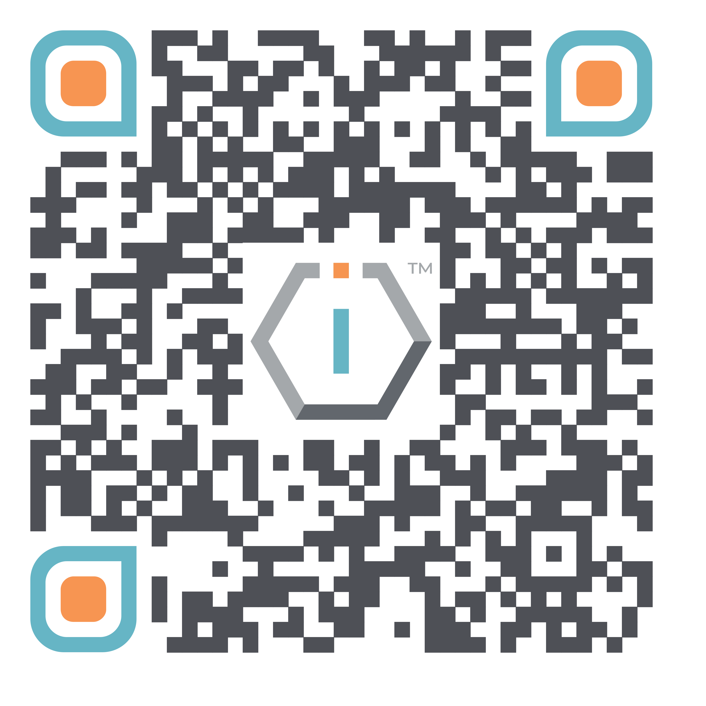

# Annual Reports




[**ShortURL**](https://short.theiofoundation.org/TIOFAnnualReports) **|&#x20;**~~**Playbook**~~**&#x20;|&#x20;**~~**Assistant**~~




Use this QR Code to quickly share this page.

<figure><figcaption>
QR Code of this page
</figcaption></figure>



## About

This section contains all annual reports issued by The IO Foundation, organized by Seasons (fiscal years).


* Fiscal years comprise from 1st January to 31st December of a natural year.
* The IO Foundation labels its fiscal years as _**Seasons**_.



Please note that the reports are organized through tabs in the corresponding Season's page.


## 📕 Institutional Reports

In line to its transparency and accountability commitment, The IO Foundation publishes the following institutional reports that provide an account of each Season's strategies.

### 📙 Board Meeting

The Board Meeting report provides a summary of the annual Board Meeting that takes place annually and as described in the organization's Statute.

### 📗 General Meeting

The General Meeting report provides an account of the annual General Meeting that takes place annually and as described in the organization's Statute.

### 💥Impact Reports

The IO Foundation equally wishes to issue annual reports on its activities and impact assessment.

At the date of writing this has been impossible due to lack of resources and concentrating efforts in producing research and generating impact.

The organization is nonetheless actively working on this subject and will make all possible efforts to issue a Impact Reports as soon as possible.

## 📘 Operational Reports

Equally in line to its transparency and accountability commitment, The IO Foundation strives to publish the following operational reports that provide an account of how did the organization implemented the Season's strategies and its measured outcomes.

### 📊 Financial Reports

In compliance with the Estonian law, TIOF files an annual financial report to the Estonian authorities which is previously verified by an Estonian-licensed auditor.


* The IO Foundation is a registered non-profit in Estonia. It's fiscal year is defined from 1st January to 31st December.
* The IO Network MY Sdn. Bhd. is a registered company in Malaysia. It's fiscal year is defined from 1st January to 31st December.
* The IO Network US Foundation is a registered non-profit in the United States of America. It's fiscal year is defined from 1st January to 31st December.


### 📑 Strat Meeting

The Strat Meeting report provides an account of The IO Foundation's annual strategic gathering where objectives are set for the following Season.
