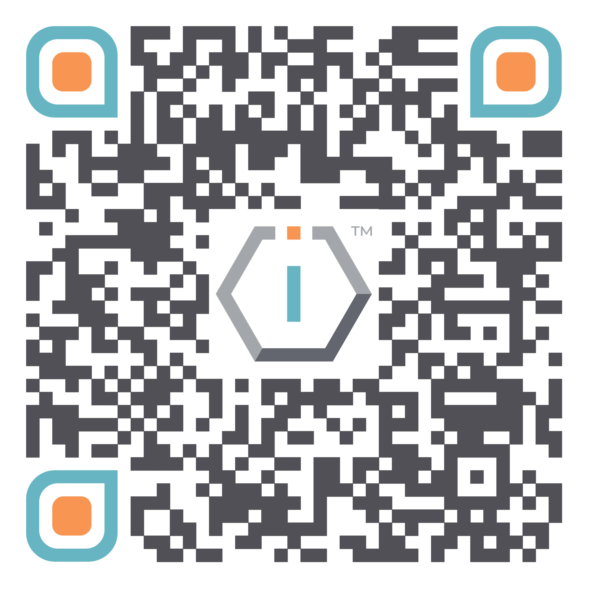

# Governance




[**ShortURL**](https://short.theiofoundation.org/TIOFDocsGovernance) **|&#x20;**~~**Playbook**~~**&#x20;|&#x20;**~~**Assistant**~~




Use this QR Code to quickly share this page.

<figure><figcaption>
QR Code of this page
</figcaption></figure>



## About

The governance structure of The IO Foundation outlines the roles, relationships and responsibilities of various boards and its Executive Team, ensuring effective management, accountability and alignment with the organization's mission and objectives.

## Governing Structure

<table data-view="cards"><thead><tr><th></th><th></th></tr></thead><tbody><tr><td><strong>Boards</strong></td><td>Check the different boards guiding and steering the work of The IO Foundation.</td></tr><tr><td><strong>Executive Team</strong></td><td>(Coming soon.)</td></tr></tbody></table>

## Organizational Chart


## DISCLAIMER

Please note that this section is currently undergoing maintenance to update its content.\
\
We apologize for any inconvenience as we ensure that we finalized it in the shortest of times.\
\
THE IO FOUNDATION


