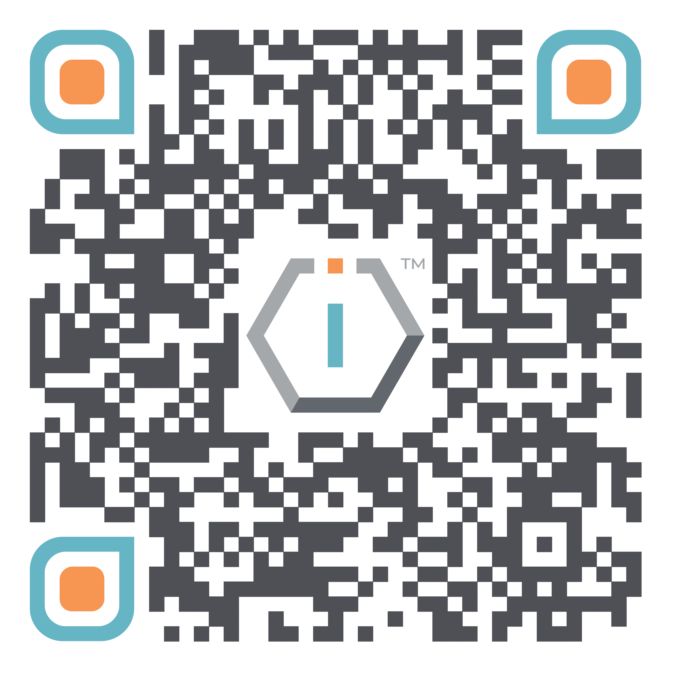

# 👥 Boards




[**ShortURL**](https://short.theiofoundation.org/TIOFOrgBoards) **|&#x20;**~~**Playbook**~~**&#x20;|&#x20;**~~**Assistant**~~




Use this QR Code to quickly share this page.

<figure><figcaption>
QR Code of this page
</figcaption></figure>



## About

The different Boards participating in The IO Foundation play a crucial role in its governance as well as setting its strategic direction and policies to ensure the organization's mission and goals are effectively pursued.

They provide oversight and guidance, making key decisions on budgeting, activities and long-term planning, while also serving as ambassadors to the broader stakeholder community to garner support and resources.

## Board of Directors

The Board of Directors is responsible for the overall governance of the organization, making key strategic decisions and ensuring that The IO Foundation adheres to its mission and legal responsibilities.

Directors shall also represent TIOF in events and actively seek for support from local stakeholders.

|                                                                                         |                 |             |
| --------------------------------------------------------------------------------------- | --------------- | ----------- |
|  | Jean F. Queralt | France      |
|   | John Duenas     | Philippines |

## Board of Advisers

The Board of Advisers provides expert guidance and advice to The IO Foundation, offering insights and recommendations to inform strategic direction and operational effectiveness.

|                                                                                        |                     |                          |
| -------------------------------------------------------------------------------------- | ------------------- | ------------------------ |
|  | Dr. Ahmad Azhar     | Telecom Ecosystem        |
|  | Denis Oakley        | Global Strategy          |
|  | Javier Ramirez      | Innovation & IP          |
|                                | Maya Vandenbroeck   | Organization Development |
|  | Maznuddin Zainuddin | Corporate Strategy (MYS) |
| .png>)                           | Tevanraj Elengoe    | Tech Ecosystem (MYS)     |

## Board of Consultants

The Board of Consultants consists of specialists who offer detailed, technical advice and solutions in specific projects.

## Board of Auditors

The Board of Auditors is tasked with overseeing the financial practices and transparency of The IO Foundation, ensuring accuracy, compliance and integrity in financial reporting and management.

|                                                                                        |            |                   |
| -------------------------------------------------------------------------------------- | ---------- | ----------------- |
|  | Lauri Kurs | Legal (Estonia)   |
|  | Karin Rand | Finance (Estonia) |

### Rights and Responsibilities

The following is a concise summary of the Rights and Responsibilities for each Board members, outlining their entitlements and obligations within the organization.

<table><thead><tr><th width="174"></th><th width="139">Director<select><option value="8da6b515ce304f51b738415c7347165a" label="Yes" color="blue"></option><option value="11bfc056215548a8aaf7e1549fb8bf64" label="No" color="blue"></option><option value="728954a1c4864a11ad7e712bce8ff575" label="Mandatory" color="blue"></option><option value="3e9e2a4807ef426e97e47410a142aecb" label="Recommended" color="blue"></option><option value="690f907faafe40cca2e82d0dd9671b27" label="Optional" color="blue"></option></select></th><th width="138">Adviser<select><option value="bdd4097a1009482d84d980907863c9ab" label="Yes" color="blue"></option><option value="d64e0dc628084c15b723e5e6a2427c0d" label="No" color="blue"></option><option value="56235f85c73b4a74920b57277da590d2" label="Mandatory" color="blue"></option><option value="faf4ad16abff46cdbee40a6b17b13f9c" label="Recommended" color="blue"></option><option value="5fb1efd56ff040bb8b3ca90feb1b37fa" label="Optional" color="blue"></option><option value="55ddb33f193744f3b7c9302195cb880d" label="As per rate (Donated)" color="blue"></option><option value="5cebf2982dc5462ea59c9dd7b257abea" label="As per rate (Paid)" color="blue"></option></select></th><th>Consultant<select><option value="d973700e491a4cc1acce7185b9367e7c" label="Yes" color="blue"></option><option value="96bf3da49fb1429b8ac66754d98af720" label="No" color="blue"></option><option value="bd9faced3f1b45e8b4fbac22f6bebffe" label="Mandatory" color="blue"></option><option value="4d791e6ce9784ca58901595b07675fd0" label="Recommended" color="blue"></option><option value="9b537ff3f74c45328a89d9a613df710c" label="Optional" color="blue"></option><option value="982b617f63f74e8ca7cf3183e1558f25" label="As per rate (Donated)" color="blue"></option><option value="b667d27d8e1545b186268b2c09dfd4b3" label="As per rate (Paid)" color="blue"></option></select></th><th>Auditor<select><option value="a01a38d43ff141a780e48daf354ab692" label="Yes" color="blue"></option><option value="b286983ee8dc44f7a7ca9557fb6527b7" label="No" color="blue"></option><option value="3ea70447d69a4bffb569344ec0959ceb" label="Mandatory" color="blue"></option><option value="e9620b1aee454b55a2902050d10fa7fb" label="Recommended" color="blue"></option><option value="0be76df796004ea590ff291bebc52629" label="Optional" color="blue"></option><option value="254be280bb2a4de6af5e42762d015a6a" label="As per rate (Donated)" color="blue"></option><option value="e9182090a5c5403b81febf7e48e7c79b" label="As per rate (Paid)" color="blue"></option></select></th></tr></thead><tbody><tr><td><strong>Rights</strong></td><td></td><td></td><td></td><td></td></tr><tr><td>Vote @ AGM</td><td>Yes</td><td>No</td><td>No</td><td>No</td></tr><tr><td>Default Salary</td><td>No</td><td>As per rate (Donated)</td><td>As per rate (Donated)</td><td>As per rate (Paid)</td></tr><tr><td>Project Salary</td><td>No</td><td>As per rate (Paid)</td><td>As per rate (Paid)</td><td>As per rate (Paid)</td></tr><tr><td><strong>Responsibilities</strong></td><td></td><td></td><td></td><td></td></tr><tr><td>Attend Status Calls</td><td>Optional</td><td>Optional</td><td>Recommended</td><td>No</td></tr><tr><td>Attend Q Status Calls</td><td>Yes</td><td>Recommended</td><td>Recommended</td><td>Optional</td></tr><tr><td>Attend AGM</td><td>Yes</td><td>Recommended</td><td>Recommended</td><td>Recommended</td></tr><tr><td>Attend Strat Meet</td><td>Recommended</td><td>Yes</td><td>Yes</td><td>Optional</td></tr><tr><td>Attend Onboarding</td><td>Yes</td><td>Yes</td><td>Yes</td><td>Yes</td></tr><tr><td>Attend Deboarding</td><td>Yes</td><td>Yes</td><td>Yes</td><td>Yes</td></tr></tbody></table>

