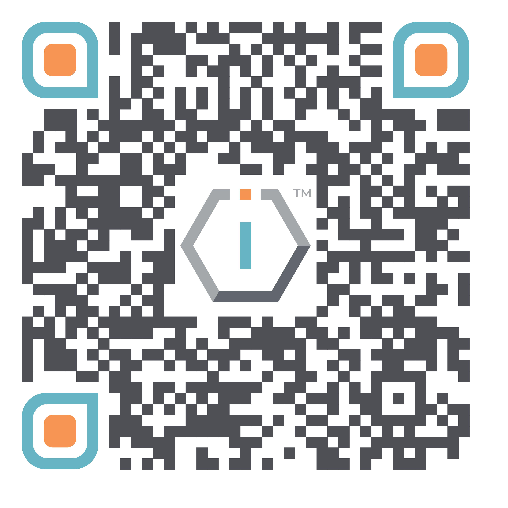

# Boards




[**ShortURL**](https://short.theiofoundation.org/TIOFOrgBoards) **|&#x20;**~~**Playbook**~~**&#x20;|&#x20;**~~**Assistant**~~




Use this QR Code to quickly share this page.

<figure><figcaption>
QR Code of this page
</figcaption></figure>



## About

The different Boards participating in The IO Foundation play a crucial role in its governance as well as setting its strategic direction and policies to ensure the organization's mission and goals are effectively pursued.

They provide oversight and guidance, making key decisions on budgeting, activities and long-term planning, while also serving as ambassadors to the broader stakeholder community to garner support and resources.

**INSERT CTAS**

## Board of Directors

The Board of Directors is responsible for the overall governance of the organization, making key strategic decisions and ensuring that The IO Foundation adheres to its mission and legal responsibilities.

Directors shall also represent TIOF in events and actively seek for support from local stakeholders.

<table data-view="cards"><thead><tr><th></th><th></th><th data-hidden data-card-cover data-type="image">Cover image</th></tr></thead><tbody><tr><td>Jean F. Queralt</td><td>France</td><td><a href="../../../.gitbook/assets/[TIOF] Comms [P] ProfilePic JFQ BW.T XXX v1.0.png">[TIOF] Comms [P] ProfilePic JFQ BW.T XXX v1.0.png</a></td></tr><tr><td>John Duenas</td><td>Philippines</td><td><a href="../../../.gitbook/assets/[TIOF] Comms [P] ProfilePic JD BW Circle.T XXX v1.0.png">[TIOF] Comms [P] ProfilePic JD BW Circle.T XXX v1.0.png</a></td></tr><tr><td>Jack Loveridge</td><td>United States</td><td></td></tr></tbody></table>

## Board of Advisers

The Board of Advisers provides expert guidance and advice to The IO Foundation, offering insights and recommendations to inform strategic direction and operational effectiveness.

<table data-view="cards"><thead><tr><th></th><th></th><th></th></tr></thead><tbody><tr><td>Dr. Ahmad Azhar</td><td>Malaysia</td><td>Telecom Ecosystem</td></tr><tr><td>Denis Oakley</td><td>United Kingdom</td><td>Global Strategy</td></tr><tr><td>Javier Ramirez</td><td>Chile</td><td>Innovation &#x26; IP</td></tr><tr><td>Maya Vandenbroeck</td><td>Philippines</td><td>Organization Development</td></tr><tr><td>Maznuddin Zainuddin</td><td>Malaysia</td><td>Corporate Strategy (MYS)</td></tr><tr><td>Tevanraj Elengoe</td><td>Malaysia</td><td>Tech Ecosystem (MYS)</td></tr></tbody></table>

## Board of Consultants

The Board of Consultants consists of specialists who offer detailed, technical advice and solutions in specific projects.

## Board of Auditors

The Board of Auditors is tasked with overseeing the financial practices and transparency of The IO Foundation, ensuring accuracy, compliance and integrity in financial reporting and management.

<table data-view="cards"><thead><tr><th></th><th></th><th></th></tr></thead><tbody><tr><td>Lauri Kurs</td><td>Estonia</td><td>Legal (Estonia)</td></tr><tr><td>Karin Rand</td><td>Estonia</td><td>Finance (Estonia)</td></tr><tr><td>NorthWest Agent</td><td>United States</td><td></td></tr><tr><td>Mark Leong</td><td>Malaysia</td><td>Company Secretary</td></tr><tr><td>Ding Hor Kien</td><td>Malaysia</td><td>Finance (Malaysia)</td></tr></tbody></table>
