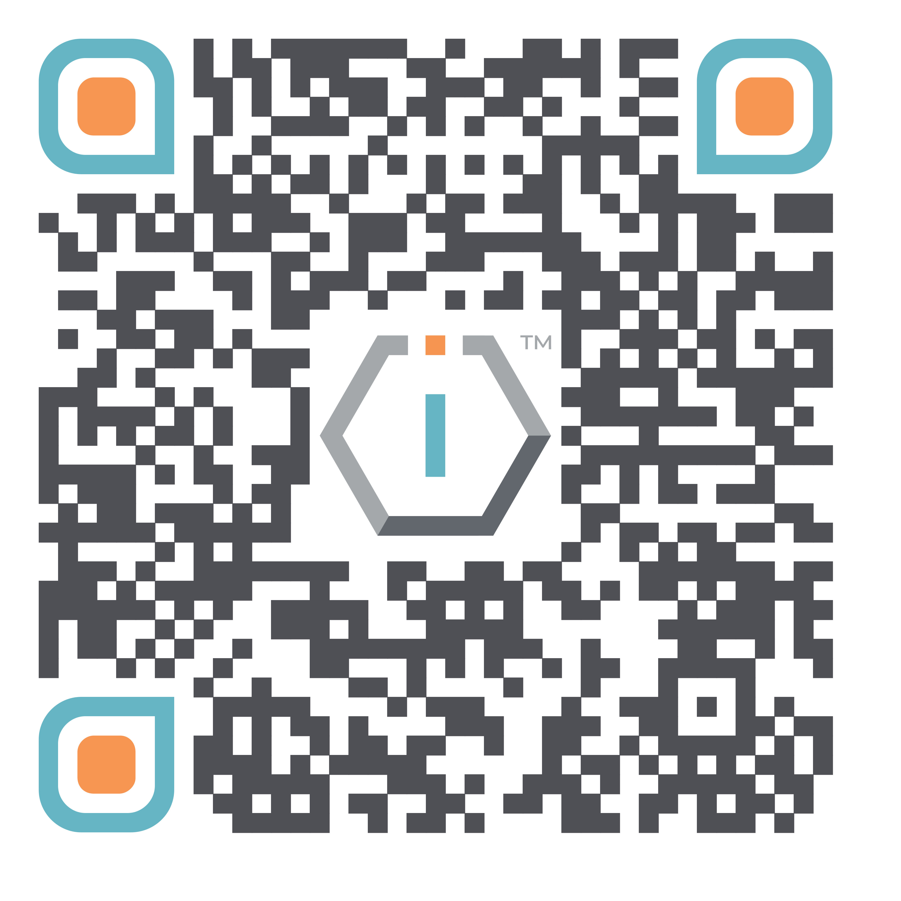

# The TIOF Network




[**ShortURL**](https://short.theiofoundation.org/TIOFNetworkInfo) **|&#x20;**~~**Playbook**~~**&#x20;|&#x20;**~~**Assistant**~~




Use this QR Code to quickly share this page.

<figure><figcaption>
QR Code of this page
</figcaption></figure>



## About

The IO Foundation is a forward-thinking global tech NGO that traces its origins back to the innovative digital landscape of Estonia. While born in a country renowned for its advanced e-governance and digital society, over the years the organization has grown beyond its birthplace, establishing a dynamic presence in multiple jurisdictions around the world.

Despite the geographic spread, The IO Foundation operates as a singular, cohesive entity—a united network of organizations committed to shaping a future where technology serves the common good and upholds human dignity. Our cross-border collaborations and unified policies ensure that the whole network acts strategically and harmoniously, embodying our core values in every location where we operate.

## Organizations

The following is a list of the organizations composing The IO Foundation network. Please find more exhaustive information about each organization in their corresponding section.


You can click on the corresponding organization to see all of its information.


<table data-view="cards"><thead><tr><th></th><th></th><th data-hidden data-card-cover data-type="files"></th><th data-hidden data-card-target data-type="content-ref"></th></tr></thead><tbody><tr><td>The IO Foundation</td><td>Estonia</td><td><a href="../../.gitbook/assets/[TIOF] Comms [P] Dotted Map EST MedRes XXX v1.0.png">[TIOF] Comms [P] Dotted Map EST MedRes XXX v1.0.png</a></td><td><a href="the-io-foundation-mtue/">the-io-foundation-mtue</a></td></tr><tr><td>The IO Network US</td><td>United States</td><td><a href="../../.gitbook/assets/[TIOF] Comms [P] Dotted Map USA MedRes XXX v1.0 (1).png">[TIOF] Comms [P] Dotted Map USA MedRes XXX v1.0 (1).png</a></td><td><a href="the-io-network-us-foundation/">the-io-network-us-foundation</a></td></tr><tr><td>The IO Network MY</td><td>Malaysia</td><td><a href="../../.gitbook/assets/[TIOF] Comms [P] Dotted Map MYS MedRes XXX v1.0.png">[TIOF] Comms [P] Dotted Map MYS MedRes XXX v1.0.png</a></td><td><a href="the-io-network-my-sdn-bhd/">the-io-network-my-sdn-bhd</a></td></tr></tbody></table>

