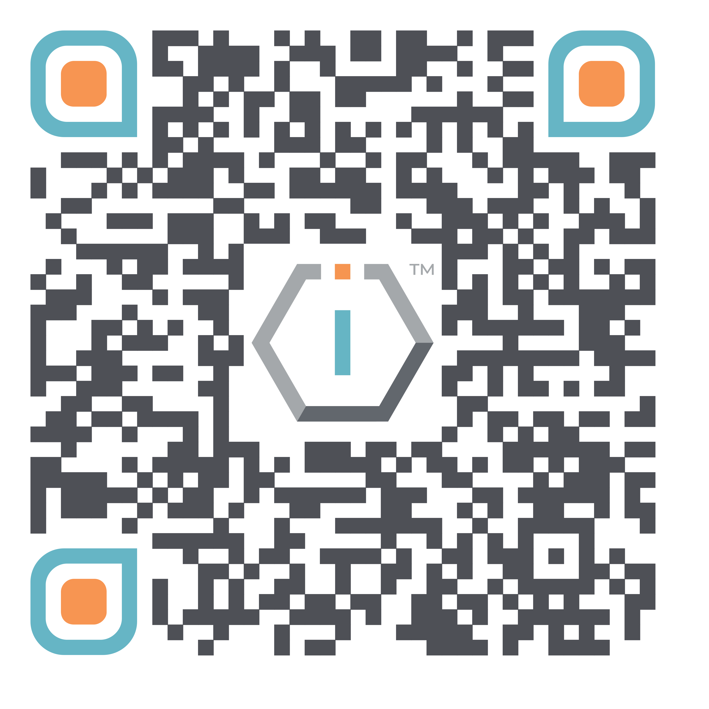

# 🇪🇪 The IO Foundation MTÜ




[**ShortURL**](https://short.theiofoundation.org/TIOFOrgInfo) **|&#x20;**~~**Playbook**~~**&#x20;|&#x20;**~~**Assistant**~~




Use this QR Code to quickly share this page.

<figure><figcaption>
QR Code of this page
</figcaption></figure>



## About

The following is the basic institutional information about The IO Foundation.


You may use this information for invoicing purposes.


<table><thead><tr><th width="150">Item</th><th>Value</th></tr></thead><tbody><tr><td><strong>Country</strong></td><td>Estonia</td></tr><tr><td><strong>Official Name</strong></td><td>The IO Foundation Mittetulundusühing</td></tr><tr><td><strong>Type</strong></td><td>Non profit</td></tr><tr><td><strong>Public use name</strong></td><td>The IO Foundation</td></tr><tr><td><strong>Date of establishment</strong></td><td>05 / 04 / 2018</td></tr><tr><td><strong>Registration ID</strong></td><td>80549272</td></tr><tr><td><strong>VAT number</strong></td><td>N/A</td></tr><tr><td><strong>Correspondence &#x26;</strong> <strong>Invoicing Address</strong></td><td>Rataskaevu tn 2
 Kesklinna linnaosa
 10123 Tallinn
 Harju maakond
 Estonia</td></tr><tr><td><strong>Trading Address</strong></td><td>Co-labs The Starling
 6, Jalan SS 21/37
 Damansara Utama
 47400 Petaling Jaya
 Malaysia</td></tr><tr><td><strong>TIOF Code</strong></td><td>TIOF</td></tr></tbody></table>

## Governance

The IO Foundation's governance adheres to the following documents:

<table data-view="cards"><thead><tr><th></th><th></th></tr></thead><tbody><tr><td><a data-mention href="memorandum-of-association.md">memorandum-of-association.md</a></td><td>Legal incorporation of the organization.</td></tr><tr><td><a data-mention href="articles-of-association.md">articles-of-association.md</a></td><td>Basic Governance provisions.</td></tr><tr><td><a data-mention href="organization-statute.md">organization-statute.md</a></td><td>Complete Governance provisions.</td></tr></tbody></table>

## Other Registrations & Certifications

The following is a list of other registrations and certifications for The IO Foundation.

| Registration                                                                                                                                                   | ID (Verification link when available)                                                      |
| -------------------------------------------------------------------------------------------------------------------------------------------------------------- | ------------------------------------------------------------------------------------------ |
| [EMTAK Code](https://www.rik.ee/en/e-business-registry/emtak-fields-activities)                                                                                | [62091](https://emtak.rik.ee/EMTAK/pages/klassifikaatorOtsing.jspx)                        |
| United Nations                                                                                                                                                 | **`Ongoing`**                                                                              |
| SAM Unique Entity ID                                                                                                                                           | [DMW1GZS2H5S5](https://unitedstatesbusinessregistration.us/check-sam-registration-status/) |
| DUNS                                                                                                                                                           | 536406268                                                                                  |
| [NACE Code](https://ec.europa.eu/eurostat/ramon/nomenclatures/index.cfm?TargetUrl=LST_CLS_DLD\&StrNom=NACE_REV2\&StrLanguageCode=EN\&StrLayoutCode=HIERARCHIC) | [62.09](https://nacev2.com/en/search?q=62.09)                                              |
| [NCAGE](https://eportal.nspa.nato.int/Codification/Support/en/Products/NCAGE/)                                                                                 | [010BJ](https://eportal.nspa.nato.int/Codification/CageTool/cage-view/010BJ)               |

