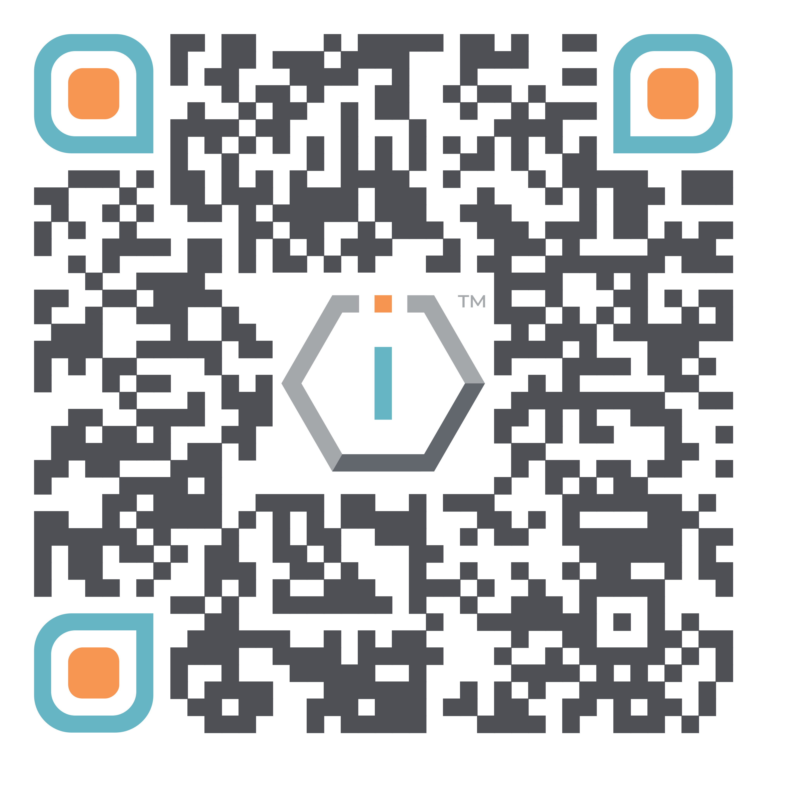

# ☑️ Verification of NGO Status




[**ShortURL**](https://short.theiofoundation.org/tiofregistrationcheck) **|&#x20;**~~**Playbook**~~**&#x20;|&#x20;**~~**Assistant**~~




Use this QR Code to quickly share this page.

<figure><figcaption>
QR Code for this page
</figcaption></figure>



## About

The IO Foundation is a nonprofit organization registered in Estonia under their [e-Residency program](https://www.e-resident.gov.ee/).

This document provides methods to verify the legal nonprofit status of The IO Foundation.

## **Direct Link**

The direct link to the Foundation's info page is:

[https://ariregister.rik.ee/ettevotja?lang=eng\&id=9000220393](https://ariregister.rik.ee/ettevotja?lang=eng\&id=9000220393)

## **Manual verification**

* Go to [https://ariregister.rik.ee/eng](https://ariregister.rik.ee/eng)
* Enter "The IO Foundation"
* Press Search
* Click on the entry


**PLEASE NOTE**

1. The nonprofit status of the organization
2. Being a recently founded organization we do not have VAT yet (we do not qualify yet to be VAT-liable under Estonian Law)



For any doubts, feel free to [**contact us**](mailto://Contact@TheIOFoundation.org).



