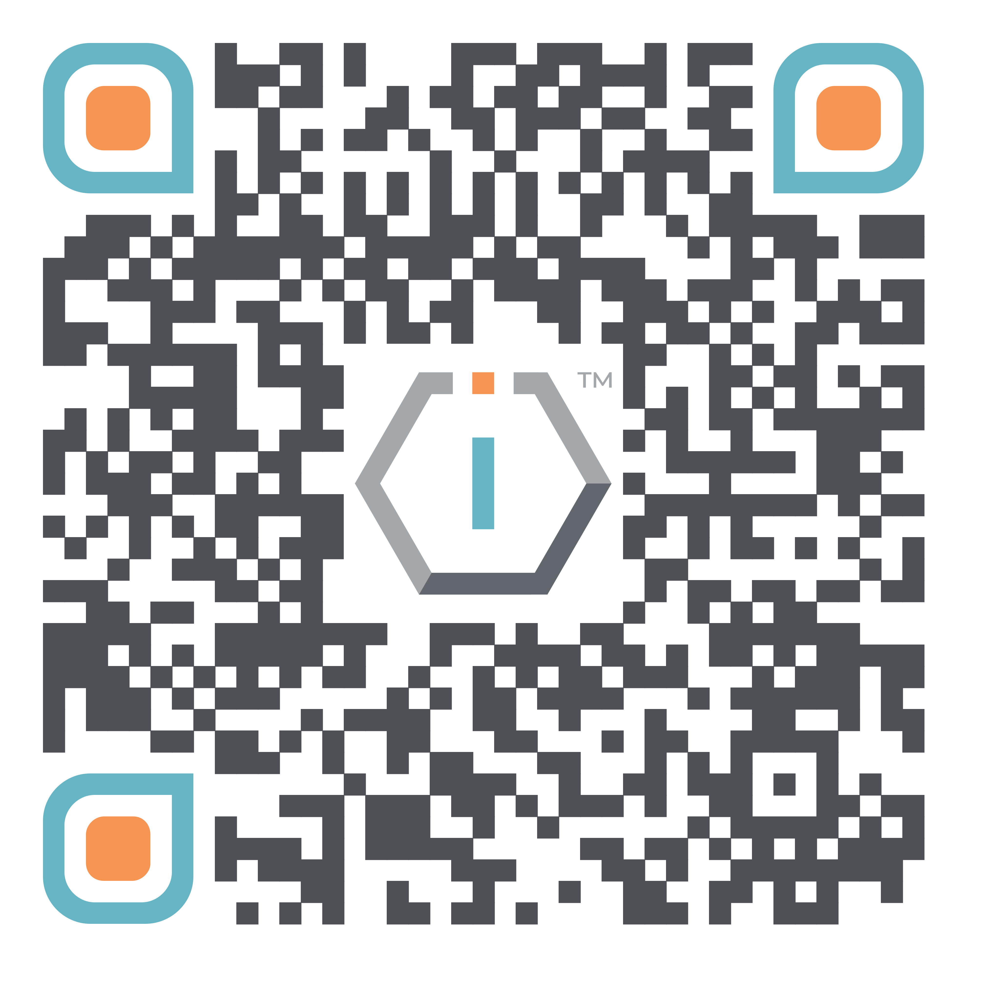

# 🇲🇾 The IO Network MY Sdn. Bhd.




[**ShortURL**](https://short.theiofoundation.org/TIONMYOrgInfo) **|&#x20;**~~**Playbook**~~**&#x20;|&#x20;**~~**Assistant**~~




Use this QR Code to quickly share this page.

<figure><figcaption>
QR Code of this page
</figcaption></figure>



## About

The following is the basic institutional information about The IO Network MY.


You may use this information for invoicing purposes.


<table><thead><tr><th width="150">Item</th><th>Value</th></tr></thead><tbody><tr><td><strong>Country</strong></td><td>Malaysia</td></tr><tr><td><strong>Official Name</strong></td><td>The IO Network MY Sdn. Bhd.</td></tr><tr><td><strong>Type</strong></td><td>Private Limited Company</td></tr><tr><td><strong>Public use name</strong></td><td>The IO Foundation</td></tr><tr><td><strong>Date of establishment</strong></td><td>22 / 02 / 2019</td></tr><tr><td><strong>Registration ID</strong></td><td>201901006042</td></tr><tr><td><strong>Registration ID (Previous format)</strong></td><td>1315369-A</td></tr><tr><td><strong>Correspondence &#x26;</strong> <strong>Invoicing Address</strong></td><td>Co-labs The Starling
 6, Jalan SS 21/37
 Damansara Uptown 47400 Petaling Jaya
 Malaysia</td></tr><tr><td><strong>Trading Address</strong></td><td>Co-labs The Starling
 6, Jalan SS 21/37
 Damansara Uptown
 47400 Petaling Jaya
 Malaysia</td></tr><tr><td><strong>TIOF Code</strong></td><td>TION MY</td></tr></tbody></table>

## Governance

The IO Network MY's governance adheres to the following documents:


## 🚧 Work in progress

The following information is currently undergoing maintenance to update its content.\
\
We apologize for any inconvenience as we ensure that we finalized it in the shortest of times.\
\
THE IO FOUNDATION


## Other Registrations & Certifications

The following is a list of other registrations and certifications for The IO Foundation.

| Registration                                                                                                                                                   | ID (Verification link when available)                                                      |
| -------------------------------------------------------------------------------------------------------------------------------------------------------------- | ------------------------------------------------------------------------------------------ |
| HRDCorp                                                                                                                                                        | Training Provider (Since 25/03/2024)                                                       |
| SAM Unique Entity ID                                                                                                                                           | [K866ZUERGRR3](https://unitedstatesbusinessregistration.us/check-sam-registration-status/) |
| DUNS                                                                                                                                                           | 659310323                                                                                  |
| [NACE Code](https://ec.europa.eu/eurostat/ramon/nomenclatures/index.cfm?TargetUrl=LST_CLS_DLD\&StrNom=NACE_REV2\&StrLanguageCode=EN\&StrLayoutCode=HIERARCHIC) | [62.09](https://nacev2.com/en/search?q=62.09)                                              |
| [NCAGE](https://eportal.nspa.nato.int/Codification/Support/en/Products/NCAGE/)                                                                                 | [Y0599](https://eportal.nspa.nato.int/Codification/CageTool/cage-view/Y0599)               |

