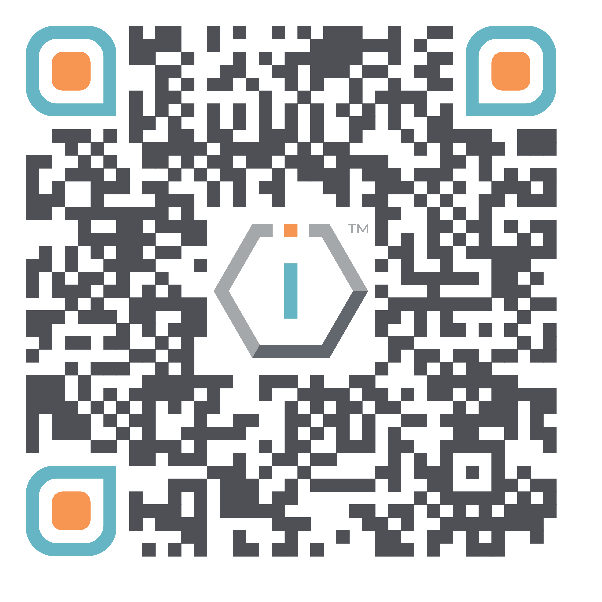

# 🇺🇸 The IO Network US Foundation




[**ShortURL**](https://short.theiofoundation.org/TIONUSOrgInfo) **|&#x20;**~~**Playbook**~~**&#x20;|&#x20;**~~**Assistant**~~




Use this QR Code to quickly share this page.

<figure><figcaption>
QR Code of this page
</figcaption></figure>



## About

The following is the basic institutional information about The IO Network US.

| Item                      | Value                        |
| ------------------------- | ---------------------------- |
| **Country**               | United States (Delaware)     |
| **Official Name**         | The IO Network US Foundation |
| **Type**                  | Non profit                   |
| **Public use name**       | The IO Foundation            |
| **Date of establishment** | 01 / 08 / 2023               |
| **Registration number**   | 7597974                      |
| **TIOF Code**             | TION US                      |

## Governance

The IO Network US's governance adheres to the following documents:

| Document                         | Usage                                                              |
| -------------------------------- | ------------------------------------------------------------------ |
| [bylaws.md](bylaws.md "mention") | Legal incorporation and Governance provisions of the organization. |

## Other Registrations & Certifications

The following is a list of other registrations and certifications for The IO Foundation.

| Registration                                                                                                                                                   | ID (Verification link when available)                                                      |
| -------------------------------------------------------------------------------------------------------------------------------------------------------------- | ------------------------------------------------------------------------------------------ |
| IRS EIN                                                                                                                                                        | 61-2106784                                                                                 |
| 501(c)(3) Status                                                                                                                                               | Since August 1st, 2023                                                                     |
| SAM Unique Entity ID                                                                                                                                           | [XTZBJHXQZKZ5](https://unitedstatesbusinessregistration.us/check-sam-registration-status/) |
| D-U-N-S                                                                                                                                                        | 11-940-1738                                                                                |
| [NACE Code](https://ec.europa.eu/eurostat/ramon/nomenclatures/index.cfm?TargetUrl=LST_CLS_DLD\&StrNom=NACE_REV2\&StrLanguageCode=EN\&StrLayoutCode=HIERARCHIC) | [62.09](https://nacev2.com/en/search?q=62.09)                                              |
| [NCAGE](https://eportal.nspa.nato.int/Codification/Support/en/Products/NCAGE/)                                                                                 | **`In Progress`**                                                                          |

