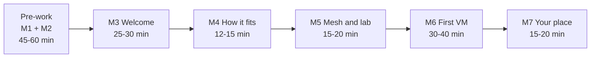
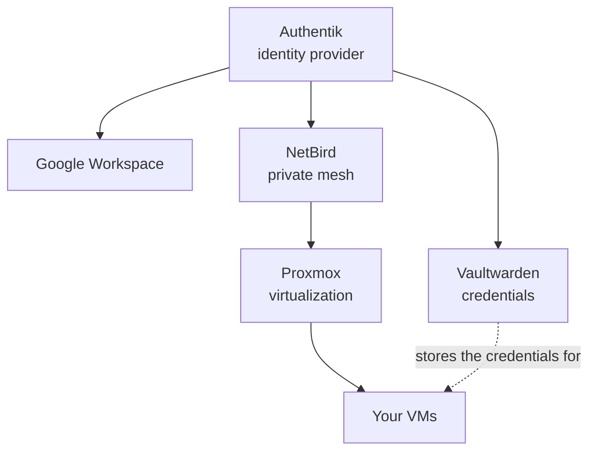

# AP-110 trainer script (TEMP)

**Becoming an Argos Club Member** · Trainer script v0.2 · For Onboarding Executives and TIOF staff


**How to use this page.** Read it once end to end, then use each module as your cue sheet during the session. It gives key messages in the voice of the UMN, Maranatha and Pradita sessions. It is not a text to read out. Improvise as you do today but hit every key message and every check.


| Marker                  | Meaning                                                                         |
| ----------------------- | ------------------------------------------------------------------------------- |
| 💬 **Say**              | Key message for the room                                                        |
| ❓ **Ask**               | Question for the room                                                           |
| 🖱️ **Do**              | Demonstration or action                                                         |
| 📜 **Approved wording** | Text agreed for use with members. Keep the meaning and say it in your own words |
| ✅ **Check**             | Exit check before you move on                                                   |
| ⚠️ **Watch**            | Common problem to anticipate                                                    |

## Session at a glance

<table data-view="cards"><thead><tr><th></th><th></th><th></th></tr></thead><tbody><tr><td><h3><i class="fa-laptop" style="color:$primary;">:laptop:</i></h3></td><td><strong>Pre-work</strong></td><td>M1 and M2 · 45 to 60 min · self-paced in the LMS</td></tr><tr><td><h3><i class="fa-users" style="color:$primary;">:users:</i></h3></td><td><strong>Live session</strong></td><td>M3 to M7 · 1h40 to 2h05 · led by you</td></tr><tr><td><h3><i class="fa-life-ring" style="color:$primary;">:life-ring:</i></h3></td><td><strong>Buffer</strong></td><td>15 min for connection problems</td></tr></tbody></table>


**Outcome.** Every participant leaves with a confirmed vault, a NetBird connection, a Proxmox login, a VM reached by ping (or a clear next step with you) and one way to contribute.


## 1 · Before the session



### 7 days before

Registration closes. The committee decides who is accepted and into which roles. **Nobody is provisioned before this decision.**



### 5 days before

Fill in the Argos Club variable block in section 6 at the bottom of this page. Confirm the room, the hardware and the gateway with the host.



### 3 days before

Run the provisioning batch. **Never provision live.** At UMN it consumed a large part of the session and ran into a race condition.



### 2 days before

Check that every provisioned member received the welcome email and the course link. Chase anyone missing.



### 1 day before

Run the readiness check: how many members have confirmed their vault, connected NetBird and logged into Proxmox. Message the rest on Telegram with the checklist and offer a short call.



### Morning of

Do a dry run with a test account: dashboard, vault, NetBird, Proxmox and a baseline VM. Test the campus Wi-Fi for DNS problems. Confirm that the registration QR code works for latecomers.




{% column width="50%" %}
### 👥 Team in the room

* **You:** lead the session
* **Room assistant:** watches hands and screens (ideally a ForgeMaster candidate in AP-320)
* **Committee and IT admins:** floor support
* **If you are remote:** the room assistant is your eyes and reports problems by chat


{% column width="50%" %}

**Hybrid rule.** Focus drops fast when the speaker is not in the room. Ask for a thumbs up on camera at least every 5 minutes and call people by name.




## 2 · Live session

### M3 · Welcome to your Argos Club


**⏱ 25 to 30 min** · Objectives LO1 and LO2 · Participants understand who The IO Foundation is and what an Argos Club is, and want to take part.


| Block                        | Time  |
| ---------------------------- | ----- |
| Housekeeping                 | 2 min |
| A · The IO Foundation        | 5 min |
| B1 · What an Argos Club is   | 4 min |
| B2 · Why Argos Clubs exist   | 4 min |
| B3 · What you gain           | 3 min |
| B4 · Structure and roles     | 5 min |
| B5 · Activities and services | 5 min |

#### Housekeeping

* 💬 All TIOF activities follow the code of conduct, the Dhatham House Rule (DATA plus Chatham) and the code of conduct of the host university.
* 💬 Under the rule you can use what you learn and produce materials, but you may not reveal or imply the identity or affiliation of contributors without their consent.

#### A · The IO Foundation

* 🖱️ Introduce yourself and any colleague joining.
* 💬 Open with the joke on the slide: "I'd love to change the world but they won't give me the source code." It is what inspired TIOF. In technology we did get the source code, so we can change how the world works.


**📜 Approved wording: The IO Foundation in brief**

The IO Foundation (TIOF) is a global for-impact non-profit registered in Estonia since 2018 and in the United States since 2023. It advocates for Data-Centric Digital Rights: making sure technologists build protection for people into technology by design, so that our devices remain ours at all times.


* ❓ Could you hand me every device you own for a week? Use the answers to show that we depend on our devices the way we depend on our legs, so the real question is whether they are ours.
* 💬 Data protection laws exist but they do not explain how to implement what they require. Data-Centric Digital Rights (DCDR) is the technical side: principles, taxonomies and tools that let technologists build protections in by design.
* 💬 That makes you, as technologists, the next generation of rights defenders. You are also always an end user somewhere, so protecting others starts with wanting to protect yourself.


{% column width="33%" %}
**I Am My Data**

Your data is inseparable from you. It is your digital twin and deserves the care you would want for yourself.


{% column width="33%" %}
**End Remedy**

Design systems so that harms are prevented in the first place instead of repaired afterwards.


{% column width="33%" %}
**Rights By Design**

Build the protections that regulations require into technology transparently and by design.



* 💬 TIOF runs several initiatives (the deck lists DCDR, Advocacy, BiT, TechUp, UDDR and CrowdShape). The one that matters today is **TechUp**, which brings together the TechUp Community, the TechUp Fellowships and the Argos Clubs.

#### B1 · What an Argos Club is


**📜 Approved wording: definition**

Argos Clubs are university clubs where students set out to discover what they can build and who they can become. Created by The IO Foundation within its TechUp initiative and grounded in its three Data-Centric Digital Rights Principles, they give every member two labs: the **PromptForge Lab** for hands-on technology and the **Wayfinder Lab** for personal, business and entrepreneurial skills. Members learn to keep their digital lives in their own hands, hosting and running their own technology as a habit that stays with them long after they leave the Argos Club. The IO Foundation supports each Argos Club and its members in broadening their career opportunities through networking, mainly by taking part in standards development organizations, where the technology behind the internet is shaped.

**In one line:** a university club where students explore, build and keep their digital lives in their own hands and open career doors through the world of internet standards.


* 💬 The name comes from the Argonauts: a crew that sets out to discover something new. Do not spell out the myth. Let the spirit show in how you talk.
* 💬 Joining is optional. Why join: learn new technologies beside your studies, meet cutting-edge topics through the standards bodies, try things without risking your personal laptop, practice on real cases, build your network and join the wider TechUp Community.
* 💬 Self-hosting is a way of life here. The cloud is someone else's computer and credentials should never live with third parties.

#### B2 · Why Argos Clubs exist


**📜 Approved wording: the problem and the way forward**

The next generation of technologists is entering a market that is changing fast. The IO Foundation believes that as AI tools take over more work, companies will hire fewer new engineers and more of them will build their own products and services. Hands-on entrepreneurial practice is hard to fit inside a standard curriculum, especially in science and engineering.

Meanwhile these technologists will build tomorrow's digital infrastructure, often without clear technical guidance on how to protect the people it serves. There is no standard way to define good technology. Data protection laws do not explain how to implement what they require. Technologists take little part in civil society. In Southeast Asia, Asia Pacific and beyond, awareness of these issues remains low and proactive solutions are rarer still.

The two challenges are linked. On one hand, technology can be protected by design only if the people who build it can make a living doing so. On the other hand, people who depend on infrastructure run by others cannot easily keep control of their own data, credentials and devices.

But there is a way forward: Argos Clubs give the next generation of technologists the skills to shape their own careers and the technology around them.


* 💬 Keep the tone positive and never confrontational towards universities. They host the Argos Clubs and are partners.
* 💬 The hiring shift is TIOF's position and a prediction, not an established fact. Say "we believe".

#### B3 · What you gain


**📜 Approved wording: the primary objective**

Support members' careers by preparing them, through entrepreneurship, to become the next generation of digital rights defenders in a changing market.


| What you should gain                                                                                            | Where it happens                                    |
| --------------------------------------------------------------------------------------------------------------- | --------------------------------------------------- |
| Personal, business and entrepreneurial skills: leadership, conflict management, going to market and fundraising | Wayfinder Lab and running the Argos Club itself     |
| Hands-on technical skills with the latest technology                                                            | PromptForge Lab                                     |
| A mindset of keeping your digital life in your own hands                                                        | Hosting and running your own technology             |
| A wider network and more career options                                                                         | Fellowships and standards development organizations |
| A CV that proves it: tracked projects and digitally signed certificates anyone can verify                       | Projects and trainings                              |
| An active role in safer technology by design                                                                    | All of the above                                    |

* 💬 The Argos Club is meant to stand on its own. Members learn to onboard and manage their own Argos Club with TIOF alongside as mentor and partner, and Argos Clubs are encouraged to raise funds to grow. In that sense each Argos Club is a lab of running a company.
* 💬 The Argonaut Pathway takes members from joining to helping launch new Argos Clubs. You will hear more about it at the end (M7).

🧭 Optional: how an Argos Club creates value (theory of change)

| Stage                         | Content                                                                                                                                                                                                                                                                                                                |
| ----------------------------- | ---------------------------------------------------------------------------------------------------------------------------------------------------------------------------------------------------------------------------------------------------------------------------------------------------------------------- |
| **Inputs**                    | The PromptForge Lab at the host university. Mentors from the university and TIOF. Training, accounts and network from TIOF. A committee of members. Funding                                                                                                                                                            |
| **Activities**                | Onboarding. Training Bytes at least once per semester. Course and personal projects tracked in GitHub. Wayfinder Lab work such as committee roles, events and fundraising. The Argonaut Pathway. Monthly Inter-Argos calls. Fellowships and remote participation hubs for standards bodies meetings. A yearly Assembly |
| **Outputs**                   | Argos Clubs launched. Members onboarded and trained. Projects completed. Certificates issued. Members who join fellowships. Members who complete each pathway stage                                                                                                                                                    |
| **Outcomes for every member** | Personal, business and technical skills. A portfolio of tracked projects and verifiable certificates. The ability to build a career for yourself. The mindset of running your own technology. Becoming a defender of technology that protects by design                                                                |
| **Standards track**           | Members ready to take part in standards development organizations and make sure standards are protective by design                                                                                                                                                                                                     |
| **Entrepreneur track**        | Entrepreneurs who build products grounded in the same protective principles                                                                                                                                                                                                                                            |
| **Impact**                    | Our devices remain ours at all times                                                                                                                                                                                                                                                                                   |

#### B4 · Structure and roles

* 💬 Every Argos Club works through four parts: members, a committee, mentors and an administration group (ADM). TIOF stays alongside as mentor and partner.
* 💬 **Members** are students of the host university. The committee decides who is accepted. Alumni and people from outside the university can take part where the host's policy and the committee allow it.
* 💬 The **committee** is a team of active members that runs the Argos Club. It renews itself over time and gets first access to trainings, workshops and events. Each role is a small taste of running a company, which is where the career value comes from.

| Role               | What they do                                                                                                | Company parallel              |
| ------------------ | ----------------------------------------------------------------------------------------------------------- | ----------------------------- |
| **President**      | Leads the committee, is the contact between TIOF and the university and identifies and coordinates projects | Chief executive               |
| **Vice President** | Supports the President and Secretary and represents the committee when the President is away                | Deputy chief executive        |
| **Secretary**      | Runs the administration, is a contact between TIOF and the university and tracks and reports project status | Operations and administration |
| **Treasurer**      | Manages the Argos Club's funds and activities and coordinates fundraising and sponsorship events            | Finance                       |
| **IT Admin**       | Monitors the hardware and software, reports to the committee and helps members with technical problems      | Technology                    |
| **Comms**          | Handles outreach and publishing for the Argos Club                                                          | Marketing                     |

* 💬 President, Vice President, Secretary and Treasurer are single roles. IT Admin and Comms can have several people and TIOF encourages it, so the load is shared.
* 💬 You can request a role in the registration form and the committee decides. Positions already filled can be shadowed so the next handover is smooth. The roles are not rigid and will grow as Argos Clubs develop.
* 💬 **Mentors** are lecturers of the host university who bring course projects into the Argos Club and guide members together with TIOF.
* 💬 The **ADM** is made up of the university administration, the mentors, TIOF representatives and committee representatives. It handles logistics such as room booking and campus security.

#### B5 · Activities and services

* 💬 The **PromptForge Lab** is the hardware in your room. Uses: virtualization, AI, networking, cybersecurity, DCDR framework exercises and ProtocolWatch, the project that follows what happens in standards development organizations.
* 💬 The **Wayfinder Lab** is where you practice the personal and business side: committee roles, events, fundraising and the Argonaut Pathway.
* 💬 Activities: mentor-led course projects, personal projects, training courses, remote participation hubs for standards meetings and Inter-Argos activities.
* 💬 The hardware is deliberate. TIOF wants you thinking about self-hosting, in the Argos Club and in your life.

| 🟢 Live today                                                                                    | 🛠️ In development              |
| ------------------------------------------------------------------------------------------------ | ------------------------------- |
| PromptForge Lab                                                                                  | LMS                             |
| Committees and the ADM                                                                           | Member dashboard                |
| Onboarding with a TechUp Community Account                                                       | Argos Club dashboard            |
| Mentor-led course projects                                                                       | Argos Club microsite            |
| Digitally signed certificates that anyone can verify                                             | Task repository                 |
| GitHub-tracked project reporting                                                                 | TechUp Virtual Community        |
| Remote participation hubs for standards meetings                                                 | Cloud resources for Argos Clubs |
| Monthly Inter-Argos calls (one committee representative per Argos Club and open to every member) |                                 |
| Fellowships, including some for Argos Club Members only                                          |                                 |
| ForgeMaster training                                                                             |                                 |
| Internship and volunteer openings through TIOF                                                   |                                 |


**Watch.** Marks for curriculum projects come through the mentors. Marks for personal projects and for training courses are still in progress, so present them as plans and do not promise them.



**Check.** Ask two or three people to say in their own words what an Argos Club is for and what TIOF stands for. Move on only when you hear the career, technology and community ideas and the idea that devices should remain ours.


### M4 · How it all fits together


**⏱ 12 to 15 min** · Objective LO2 · Architecture before tools, so people understand before they do.


**The physical setup** _(3 min)_

* 💬 A server, a gateway (a router, switch and access point in one box) and a UPS sit in a rack, connected to the internet through the university network.
* ❓ Thumbs up if you know the difference between a public and a private IP address. What kind of address does a server need to be reached from the internet? (A public one. Use the postal address analogy.)
* 💬 Our server sits behind the university network, behind NAT, with no public address. So how do you reach it from home?

**The answer: the mesh and the identity provider**

* 💬 NetBird builds a private virtual mesh over the internet, based on WireGuard. Only members of the mesh can see its machines. Every Argos Club has its own isolated mesh.
* 💬 Authentik is our identity provider. It is the same idea as logging in with Google or GitHub: one login that proves who you are on several platforms.
* 💬 Vaultwarden holds your credentials and Proxmox holds your virtual machines.


**Check.** Ask: what happens to your access to Proxmox if NetBird is switched off? You will prove the answer in M5.


### M5 · Connect to your mesh and your lab


**⏱ 15 to 20 min** · Objective LO5 · Everyone connects NetBird and logs into Proxmox.


**NetBird client**

* 🖱️ Open the client, three dots, **Advanced**. Manage profiles, add a profile, choose **self-hosted** and enter the mesh address from the checklist.
* 🖱️ Connect and continue with the TechUp Community Account single sign-on. Show the machines in your mesh.


**Watch.** Tailscale or any other VPN running at the same time causes collisions. Ask everyone to stop it. Some campuses interfere with NetBird DNS (seen at Pradita and Maranatha): note the name, move on and handle it one-on-one on Telegram after the session.


**Proxmox from the dashboard**

* 🖱️ Click the Proxmox icon and choose the realm **TechUp Community Account SSO**.

**The proof**

* 🖱️ Disconnect NetBird, reload Proxmox and show that the server cannot be reached. Reconnect and reload. Ask everyone to repeat it.
* 💬 Whenever you cannot reach Proxmox or a VM, check NetBird first.

**Pools and permissions**

* 💬 A pool is a folder and it cannot be nested. Switch the view to **Pool**. You can create VMs only in your own pool and you can see everyone's VMs but not touch them.

| Role     | See all VMs | Create, start, stop and delete own VMs | Start and stop anyone's VMs | Download ISOs and templates |
| -------- | :---------: | :------------------------------------: | :-------------------------: | :-------------------------: |
| Member   |      ✅      |                    ✅                   |              ❌              |              ❌              |
| IT Admin |      ✅      |                    ✅                   |              ✅              |              ✅              |
| Mentor   |      ✅      |                    ✅                   |              ❌              |              ✅              |


IT admins can stop idle VMs because forgotten machines waste shared resources.



**Check.** Everyone has a visible NetBird peer and a Proxmox login. List anyone who does not and assign a room assistant.


### M6 · Guided demo: your first VM


**⏱ 30 to 40 min** · Objectives LO4 and LO5 · Participants follow the baseline VM settings guide linked in the welcome email under the PromptForge section. Say clearly that the baseline is a starting point and they can experiment.




### Create the VM

🖱️ Create VM with the **advanced** option ticked.

* **ID and name:** use the Argos Club convention.
* **Resource pool:** pick your own. Show the error when you try someone else's, as an intentional protection.
* **Start at boot:** explain what it does.


Two people creating a VM at the same time can receive the same ID. Agree the ID policy with the committee before the session and state it here.




### Choose the OS and hardware

💬 Only ISOs already downloaded are listed. IT admins can add more (propose them on Telegram for now). Use the virtual DIY shop analogy: you pick the parts, then build a computer inside another computer.

| Tab     | Baseline setting                                          |
| ------- | --------------------------------------------------------- |
| OS      | Ubuntu server ISO                                         |
| System  | Machine type Q35 and QEMU agent on                        |
| Disk    | 32 GB with SSD emulation                                  |
| CPU     | Type **host** (uses the physical processor and is faster) |
| Memory  | 4096 MB                                                   |
| Network | Defaults                                                  |



### Confirm, start and install

💬 Nothing runs until you start it. 🖱️ Open the console and run the installer: skip updates, confirm the virtual disk, then set a hostname and a username.



### Set the password from your vault

🖱️ Open your vault and create an item in your personal collection, in the platforms area. Generate a long password (45 or more characters) with **avoid ambiguous characters** on.

* 💬 A 50-character password is fine because you never type it. Paste it into the console with PVE Snippets.
* 💬 Always create custom fields as **hidden**. You can reveal them but you cannot revert, and hidden fields protect you from shoulder surfers and screen recorders.
* 💬 Never leave items in folders.



### Register the VM on NetBird

💬 The new VM is a separate machine and it is not on the mesh yet. 🖱️ In your vault open the **NetBird setup key** item under your role and platforms.

1. Copy the client installation command and paste it into the VM with PVE Snippets.
2. Paste the registration command with the setup key. The management address is already inside it.
3. Show the VM appearing as a peer.

💬 The setup key is rotated automatically and the vault always holds the current one, so nobody has to renew it.



### Prove it with ping

🖱️ From your laptop ping the VM by name, then run a continuous ping. Disconnect NetBird and watch it fail. Reconnect and watch it recover.



⚡ Optional level-up (10 min or more)

Install a tool such as Dokploy or n8n on the VM. If there is no time, say that a training follows.


**Check.** Everyone who finishes shows a successful ping. Others note where they are stuck. Do not stop the room for one problem: timebox each at 5 minutes, then move it to Telegram.


### M7 · Your place in the Argos Club


**⏱ 15 to 20 min** · Objective LO6 · Participants choose a contribution and invite someone.


**Ways to help**

* 💬 Join the committee (shadow roles you cannot take yet), request IT Admin or Comms, help with activities, spread the word, submit your ideas and above all use the Lab.
* 💬 We want the Lab saturated. If 50 students use it and run out of RAM or GPUs, that is the evidence we need to ask donors for more.

**The network**

* 💬 Monthly Inter-Argos status calls take one committee representative per Argos Club and are open to everybody. Some trainings and fellowships are only for Argos Club Members.
* 🖱️ Show the website agent for finding current fellowships and point to the page for dates. Do not read dates out from memory.
* 💬 Associate, intern and volunteer positions are on the join page.

**The path ahead**

* 💬 The **Argonaut Pathway** is offered to every member. It takes you from joining an Argos Club through its committee roles and onboarding support to helping launch new Argos Clubs and maintain the broader network. Its stages are ForgeMaster, ForgeManager and ForgeBuilder, and those who complete it become Argonauts. ForgeMasters are the people who run onboarding sessions like this one in their own Argos Club.
* 💬 The pathway is in beta, so stage names and numbers may still change. Point to the pathway page.

**Introduction round and invitation (LO6)**

* 🖱️ Each person gives their name, their programme and one thing they want to try in the Argos Club, and asks the group one question.
* 🖱️ Each person writes down one way they will contribute and names one person they will invite with a one-sentence pitch in their own words. Record both.

**Close**

* 💬 Welcome to the Argos Club. The only useless question is the one you do not ask. Show the website for information.
* 🖱️ Ask everyone to scan the QR code and fill in the feedback form before they leave.


**Check.** You have heard every participant introduce themselves and you hold a recorded contribution and invitation for each.


## 3 · Troubleshooting card

| Symptom                                                       | First check                                                                                       |
| ------------------------------------------------------------- | ------------------------------------------------------------------------------------------------- |
| 📧 Registered but no welcome email                            | Is the person on the provisioning list? If they registered late, provision them after the session |
| 🔑 Default credentials changed before the vault was confirmed | Do not troubleshoot live. Point them to the vault reset in the dashboard support section          |
| 🚫 Cannot reach Proxmox or a VM                               | Is NetBird connected? Is another VPN such as Tailscale running?                                   |
| 🌐 NetBird connects but names do not resolve                  | Campus DNS issue. Compare Argos Club Wi-Fi and campus Wi-Fi. Handle one-on-one                    |
| 💾 Browser asks to save the password                          | Say never                                                                                         |
| ☁️ Google Drive desktop asks to back up the device            | Do not accept the backup. No uploads from personal devices to Google                              |
| ✨ Google smart features wizard                                | Disable them                                                                                      |
| 🧩 Mixed up accounts in the browser                           | Use a separate browser profile for the Argos Club                                                 |

## 4 · After the session

* [ ] Within 24 hours, message everyone who could not finish and book a one-on-one call on Telegram.
* [ ] Confirm the first-use signals (first TCA login, first NetBird connection, first Proxmox login) for every participant and update the LMS.
* [ ] Send the post-session report to TIOF: attendance, who completed each module, problems met, time per module against the plan and what you would change.
* [ ] Keep a list of the questions people asked. They are the next improvements to the course.

## 5 · Verify before the first use


1. **Default credentials:** this script says change them only after the vault is confirmed, as the UMN session showed.
2. **Marks:** marks for personal projects and for training courses are presented as plans. Certificates and mentor-led course projects are listed as live, following the Argos Club definition work.
3. **VM ID and naming policy** and the channel for proposing new ISO images.
4. **Number of Argos Clubs** and any dates you mention.
5. **TIOF wording:** no approved text for The IO Foundation existed, so the "in brief" wording is built from the deck and the sessions. The one-line explanations of the three principles come from TIOF's published writing. Check both against the official principles page.
6. **Initiatives:** BiT and CrowdShape are spelled as on the deck. Confirm the list.
7. **Approved wording:** the definition, problem statement and primary objective are the versions agreed in the Argos Club definition work. Two small edits were made for this script: "long after they leave the Argos Club" and "each Argos Club and its members". Confirm them.


## 6 · Argos Club variable block

Fill this in before each session.

| Field                                          | Value |
| ---------------------------------------------- | ----- |
| Host university and its code of conduct        |       |
| Membership policy (alumni and outside members) |       |
| Roles available                                |       |
| Number of Argos Clubs in the network today     |       |
| Hardware (for example extra GPUs)              |       |
| Wi-Fi item name in the vault                   |       |
| Mesh address                                   |       |
| VM ID and naming policy                        |       |
| Channel for proposing new ISO images           |       |
| Feedback form QR code                          |       |
