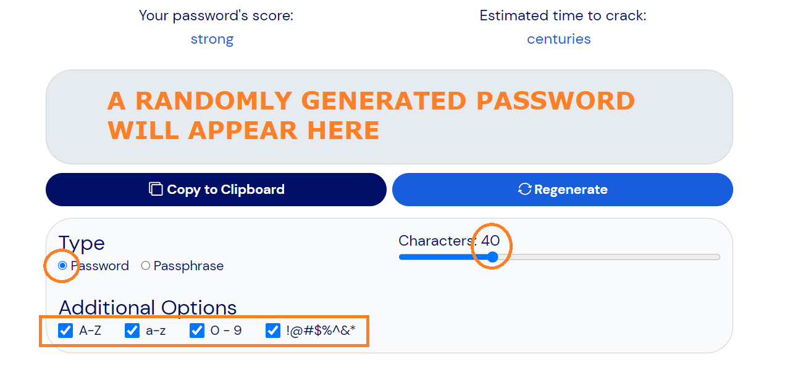

# Temp (To review and maybe delete)

Preparation for Onboarding Session

### Changing your Default Password


Please note that the first step you'll have to accomplish is to CHANGE your Default Password.


* [ ] Go to [https://Short.TheIOFoundation.org/TIOFMemberProvisioningChangeDefaultPWD](https://short.theiofoundation.org/TIOFMemberProvisioningChangeDefaultPWD).
* [ ] Log in using the TIOF Username and Default Password that were given to you in the new credentials email.

You will be required to change your password:

* [ ] To change your password:\
  \- Go to [https://bitwarden.com/password-generator/](https://bitwarden.com/password-generator/)\
  \- Select the following parameters as in the image below

<figure><figcaption>
Minimal password requirements.
</figcaption></figure>


**IMPORTANT**\
**DO NOT CLOSE THAT WINDOW UNTIL INDICATED BY THESE INSTRUCTIONS**



Please note that in the Next Steps you will be guided to create and access TIOF's Vault where you'll be able to safely store your passwords.


* [ ] &#x20;Copy the password using the "Copy to clipboard" button.
* [ ] Paste the password in the new password fields and accept.


**IMPORTANT**\
**DO NOT CLOSE THE PASSWORD UNTIL INDICATED BY THESE INSTRUCTIONS**


Once you have changed your password, you can proceed with the Next Steps.

### Registering in TIOF's Vault

<table><thead><tr><th width="191.33333333333331">Platform</th><th width="213">Actions by TIOF</th><th>Actions by You</th></tr></thead><tbody><tr><td>Vaultwarden</td><td>We will send you an invite to your TIOF email to join the platform.</td><td><ul class="contains-task-list"><li><input type="checkbox">Check your email (incluiding SPAM)</li><li><input type="checkbox">Find your invitation to Vaultwarden.</li><li><input type="checkbox">Click on the button "Join the Organization"</li><li><input type="checkbox"></li></ul></td></tr><tr><td>Slack (Communications)</td><td></td><td><ul class="contains-task-list"><li><input type="checkbox">Go to <a href="https://tiof.click/Slack">https://TIOF.Click/Slack</a> and register using the  LOGIN WITH GOOGLE button and your TIOF Member Account.</li><li><input type="checkbox">Enter the Slack space.</li><li><input type="checkbox">Explore the channels structure and get familiar with where to find what.</li></ul></td></tr><tr><td>Google Drive (Storage)</td><td></td><td><ul class="contains-task-list"><li><input type="checkbox">Go to <a href="https://tiof.click/TIOFStorage">https://TIOF.Click/TIOFStorage</a> Explore the folder structure and get familiar with where to find what.</li></ul>
Optional yet recommended: (It will make your life a bit easier)
<ul class="contains-task-list"><li><input type="checkbox">Install the Google Drive app on your devices.</li><li><input type="checkbox">Launch the app and link it with your TIOF Member Account.</li></ul>

</td></tr><tr><td>Google Calendar (Calendar)</td><td>We will send you an number of invites to your TIOF email to join some calendars.</td><td><ul class="contains-task-list"><li><input type="checkbox">Accept the invites.</li><li><input type="checkbox">Explore the calendars you have access to and get familiar with where to find what.</li></ul></td></tr><tr><td>Raindrop (Leads)</td><td>We will send you an invite to your TIOF email to join the platform.</td><td><ul class="contains-task-list"><li><input type="checkbox">Accept the invite using your TIOF Member Account. - Use the link in "Or manually open this URL" - Select the option Sign Up - Click the G button on the bottom</li><li><input type="checkbox">Explore the interface and get familiar with the folder structure.</li><li><input type="checkbox">Install the <a href="https://raindrop.io/download">Raindrop.io extension</a> in your browser.</li><li><input type="checkbox">Install the <a href="https://raindrop.io/download">Raindrop.io app</a> on your mobile.</li></ul></td></tr><tr><td>Basaas (Workspace)</td><td>We will send you an invite to your TIOF email to join the platform.</td><td><ul class="contains-task-list"><li><input type="checkbox">Accept the invite using your TIOF Member Account. ("Log in with Google" button at the bottom)</li><li><input type="checkbox">Explore the interface and get familiar with where are the different tools.</li></ul></td></tr><tr><td>Cuttles (Business Plan)</td><td>We will send you an invite to your TIOF email to join the platform.</td><td><ul class="contains-task-list"><li><input type="checkbox">Accept the invite and sign in to the platform by creating a new user account. <strong>Note: Google Login is not possible</strong></li><li><input type="checkbox">The registration process will send you an email verification.</li><li><input type="checkbox">Once you are on your dashboard, you'll see a section titled "Startup Invitations". Accept the invitation from The IO Foundation.</li><li><input type="checkbox">Explore the interface and get familiar with where to find the information that is relevant to you.</li></ul></td></tr><tr><td>ContextMinds (Mind maps)</td><td>We will send you an invite to your TIOF email to join the platform.</td><td><ul class="contains-task-list"><li><input type="checkbox">Accept the invite and register using the  SIGN IN WITH GOOGLE button and your TIOF Member Account.</li><li><input type="checkbox">Once in, select the "The IO Foundation" workspace. (Top left dropdown - By default "My Maps")</li><li><input type="checkbox">Explore the interface and get familiar with the different mind maps.</li></ul></td></tr></tbody></table>

