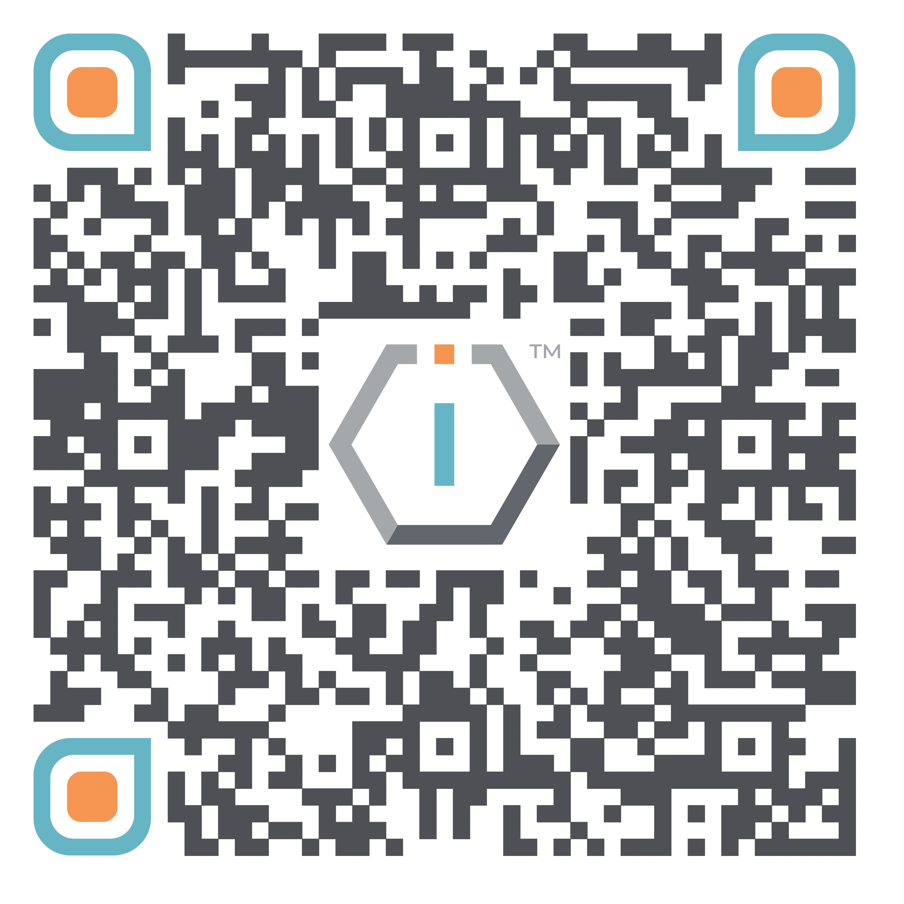

# Onboarding checklist




[**ShortURL**](https://short.theiofoundation.org/TIOFMemberProvisioningWizardNextSteps) **|&#x20;**~~**Playbook**~~**&#x20;|&#x20;**~~**Assistant**~~




Use this QR Code to quickly share this page.

<figure><figcaption>
QR Code of this page
</figcaption></figure>




## **NOTICE**

This documentation page is under construction and will be soon incorporated into our LMS.


## About

This document will guide you in the steps you need to undertake for your TIOF onboarding and access all the tools that the organization puts at your disposal.

The onboarding procedure is divided into the following steps:

| Step                                                                                                                     | Actions by TIOF                                                                                                                                                                             | Actions by You                                                                                                                                                                                                                                                                                              |
| ------------------------------------------------------------------------------------------------------------------------ | ------------------------------------------------------------------------------------------------------------------------------------------------------------------------------------------- | ----------------------------------------------------------------------------------------------------------------------------------------------------------------------------------------------------------------------------------------------------------------------------------------------------------- |
| <ol><li><a href="./#creation-of-your-basic-tiof-credentials">Creation of your basic TIOF Credentials</a></li></ol>       | <ul class="contains-task-list"><li><input type="checkbox">TIOF will create your basic organization account and sent your default credentials.</li></ul>                                     | <ul class="contains-task-list"><li><input type="checkbox"><strong>Keep the credentials safe.</strong></li></ul>                                                                                                                                                                                             |
| <ol start="2"><li><a href="./#id-2.-preparation-for-onboarding-session">Preparation for Onboarding Session</a></li></ol> | <ul class="contains-task-list"><li><input type="checkbox">TIOF will generate some internal credentials for the Onboarding Session.</li></ul>                                                | <ul class="contains-task-list"><li><input type="checkbox">
Review the list of apps below:
<ul class="contains-task-list"><li><input type="checkbox"><a href="./#mandatory-installs">Mandatory</a></li><li><input type="checkbox"><a href="./#recommended-installs">Recommended</a></li></ul></li></ul> |
| <ol start="3"><li><a href="./#id-3.-onboarding-session">Onboarding Session</a></li></ol>                                 | <ul class="contains-task-list"><li><input type="checkbox">TIOF will guide you to the full set of steps needed to onboard you and grant you access to all the tools you will need.</li></ul> | <ul class="contains-task-list"><li><input type="checkbox"> Follow the instructions during the Onboarding Session.</li></ul>                                                                                                                                                                                 |

## 1. Creation of your basic TIOF Credentials

The first step in your onboarding process will be to be assigned basic credentials (TIOF Member Account) to access TIOF's tools.


For the time being, The IO Foundation is using Google Workspace for Nonprofits.


TIOF will do the necessary to create your basic credentials. You will receive a new credentials email (titled "\[TIOF] Your new TIOF Member Account") once they are ready, which will lead you to this document.


Your TIOF Member Account will be composed by:

* Username
* Default Password


## 2. Preparation for Onboarding Session

### Mandatory installs

The following are the software preparations you need to attend to prior to your Onboarding Session.


## Estimated time

* Registrations: 30 minutes


<table><thead><tr><th width="165.33333333333331">Platform</th><th width="213">Actions by TIOF</th><th>Actions by You</th></tr></thead><tbody><tr><td>Brave browser</td><td><ul class="contains-task-list"><li><input type="checkbox">N/A</li></ul></td><td>
<strong>Install BRAVE browser and ditch whatever you are using now.</strong>
<ul class="contains-task-list"><li><input type="checkbox">Install the <a href="https://brave.com/download/">Brave browser client</a> on your laptop and/or desktop.</li><li><input type="checkbox">
Install the Brave browser app on your mobile.
<ul class="contains-task-list"><li><input type="checkbox"><a href="https://brave.com/android/">Android</a></li><li><input type="checkbox"><a href="https://brave.com/ios/">iOS</a></li></ul></li></ul></td></tr><tr><td>Vaultwarden</td><td><ul class="contains-task-list"><li><input type="checkbox">We will send you an invite to your TIOF email to join the platform.</li></ul></td><td><ul class="contains-task-list"><li><input type="checkbox">Install the <a href="https://bitwarden.com/download/#downloads-web-browser">Bitwarden extension</a> in your browser.</li></ul><ul class="contains-task-list"><li><input type="checkbox">Install the <a href="https://bitwarden.com/download/#downloads-mobile">Bitwarden app</a> on your mobile.</li><li><input type="checkbox">Install the <a href="https://bitwarden.com/download/#downloads-desktop">Bitwarden client</a> on your laptop and/or desktop.</li></ul></td></tr><tr><td>WebCatalog (Workspace)</td><td><ul class="contains-task-list"><li><input type="checkbox"> We will send you an invite to your TIOF email to join the platform.</li></ul></td><td><ul class="contains-task-list"><li><input type="checkbox">Install the <a href="https://webcatalog.io/en/desktop">WebCatalog client</a> on your laptop and/or desktop.</li></ul></td></tr><tr><td>Google Drive (Storage)</td><td><ul class="contains-task-list"><li><input type="checkbox">N/A</li></ul></td><td><ul class="contains-task-list"><li><input type="checkbox">Install the <a href="https://chromewebstore.google.com/detail/google-docs-offline/ghbmnnjooekpmoecnnnilnnbdlolhkhi">Google Docs Offline extension</a> in your browser.</li><li><input type="checkbox">Install the <a href="https://ipv4.google.com/intl/en_zm/drive/download/">Google Drive client</a> desktop on your laptop and/or desktop.</li><li><input type="checkbox">Install the <a href="https://ipv4.google.com/intl/en_zm/drive/download/">Google Drive app</a> on your mobile.</li></ul></td></tr><tr><td>Raindrop (Leads)</td><td><ul class="contains-task-list"><li><input type="checkbox">We will send you an invite to your TIOF email to join the platform.</li></ul></td><td><ul class="contains-task-list"><li><input type="checkbox">Install the <a href="https://raindrop.io/download">Raindrop.io extension</a> in your browser.</li><li><input type="checkbox">Install the <a href="https://raindrop.io/download">Raindrop.io app</a> on your mobile.</li></ul></td></tr></tbody></table>

### Recommended installs

The following are recommended browser extensions that will do your daily tasks easier.

| Item                                                                                         | Actions by You                                                                                                                                                                                                                                                                                                       | Why?                                                                                                                                                                                                            |
| -------------------------------------------------------------------------------------------- | -------------------------------------------------------------------------------------------------------------------------------------------------------------------------------------------------------------------------------------------------------------------------------------------------------------------- | --------------------------------------------------------------------------------------------------------------------------------------------------------------------------------------------------------------- |
| Tab Manager Plus for Chrome                                                                  | <ul class="contains-task-list"><li><input type="checkbox">Install this <a href="https://chromewebstore.google.com/detail/tab-manager-plus-for-chro/cnkdjjdmfiffagllbiiilooaoofcoeff?hl=en">browser extension</a> on your Brave browser.</li></ul>                                                                    | This extension highly optimizes the use, navigation and resource consumption of your opened browser tabs.                                                                                                       |
| Save image as Type                                                                           | <ul class="contains-task-list"><li><input type="checkbox">Install thisbrowser extension on your Brave browser.</li></ul>                                                                           | Exceptionally useful when having to download an image in a specific format.                                                                                                                                     |
| 
Event Merge for Google Calendar™
 +
 Gradient Merge for Google Calendar™ Events
 | <ul class="contains-task-list"><li><input type="checkbox">
Install these TWO browser extensions on your Brave browser.
<ul class="contains-task-list"><li><input type="checkbox">Event Merge for Google Calendar™</li><li><input type="checkbox">Gradient Merge for Google Calendar™ Events</li></ul></li></ul> | 
These extensions will help consolidate visually the events shown by TIOF Calendars in one single event.  Please note that both are required to work in tandem to enable the proper helping effect.
 |

## 3. Onboarding Session

The following are the core steps that you'll undertake during your Onboarding Session:

| Step                   | Actions by TIOF                                                                                                                         | Actions by You                                                                                                                                                                                                                                                                                                                       |
| ---------------------- | --------------------------------------------------------------------------------------------------------------------------------------- | ------------------------------------------------------------------------------------------------------------------------------------------------------------------------------------------------------------------------------------------------------------------------------------------------------------------------------------ |
| Access TIOF's Vault    | <ul class="contains-task-list"><li><input type="checkbox">Configure admin side for permissions.</li></ul>                               | <ul class="contains-task-list"><li><input type="checkbox">Register in TIOF's Vault.</li><li><input type="checkbox">Follow identification procedures.</li><li><input type="checkbox">Configure all Bitwarden clients to work as one.</li><li><input type="checkbox">Get familiar with Vaultwarden &#x26; Bitwarden clients.</li></ul> |
| Secure TIOF's Account  | <ul class="contains-task-list"><li><input type="checkbox">N/A</li></ul>                                                                 | <ul class="contains-task-list"><li><input type="checkbox">Update Default password.</li><li><input type="checkbox">Activate MFA.</li></ul>                                                                                                                                                                                            |
| Access Github account  | <ul class="contains-task-list"><li><input type="checkbox">We will send you an invite to your TIOF email to join the platform.</li></ul> | <ul class="contains-task-list"><li><input type="checkbox">Follow email instructions and finalize account creation.</li></ul>                                                                                                                                                                                                         |
| Configure Google Drive | <ul class="contains-task-list"><li><input type="checkbox"> Configure admin side for permissions.</li></ul>                              | <ul class="contains-task-list"><li><input type="checkbox">Configure account.</li><li><input type="checkbox">Familiarize yourself with the storage structure.</li></ul>                                                                                                                                                               |
| Access to WebCatalog   | <ul class="contains-task-list"><li><input type="checkbox">Configure admin side for permissions.</li></ul>                               | <ul class="contains-task-list"><li><input type="checkbox">Log into the platform.</li><li><input type="checkbox">Familiarize yourself with the platform and the apps.</li></ul>                                                                                                                                                       |
| Access to Gitbook      | <ul class="contains-task-list"><li><input type="checkbox">Configure admin side for permissions.</li></ul>                               | 

<ul class="contains-task-list"><li><input type="checkbox">Log into the platform.</li></ul><ul class="contains-task-list"><li><input type="checkbox">Familiarize yourself with the platform and the info structure.</li></ul>                                                                                                  |
| Access to Raindrop.io  | <ul class="contains-task-list"><li><input type="checkbox">Configure admin side for permissions.</li></ul>                               | 

<ul class="contains-task-list"><li><input type="checkbox">Log into the platform.</li></ul><ul class="contains-task-list"><li><input type="checkbox">Familiarize yourself with the platform and the info structure.</li></ul>                                                                                                  |
